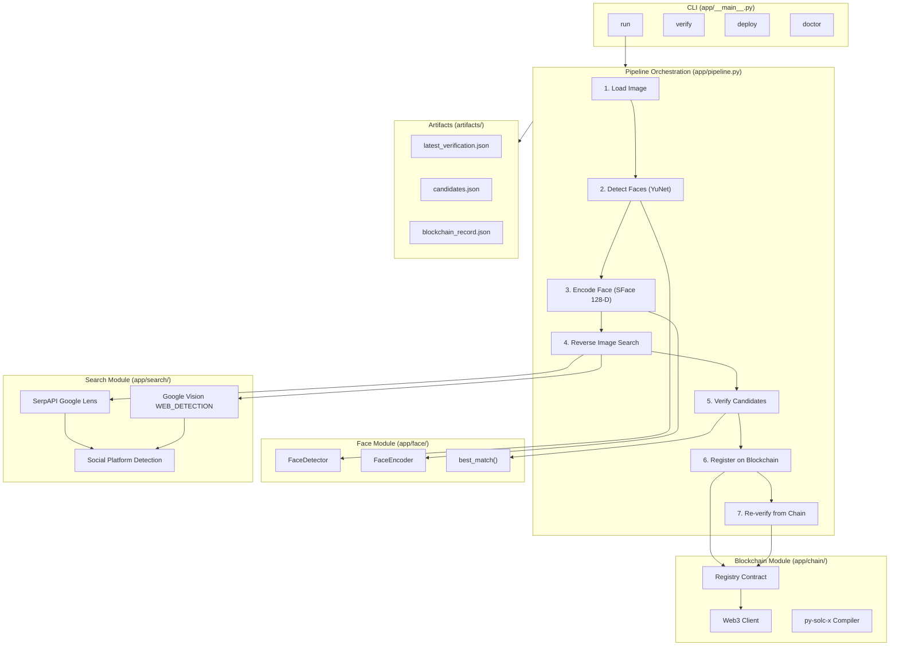
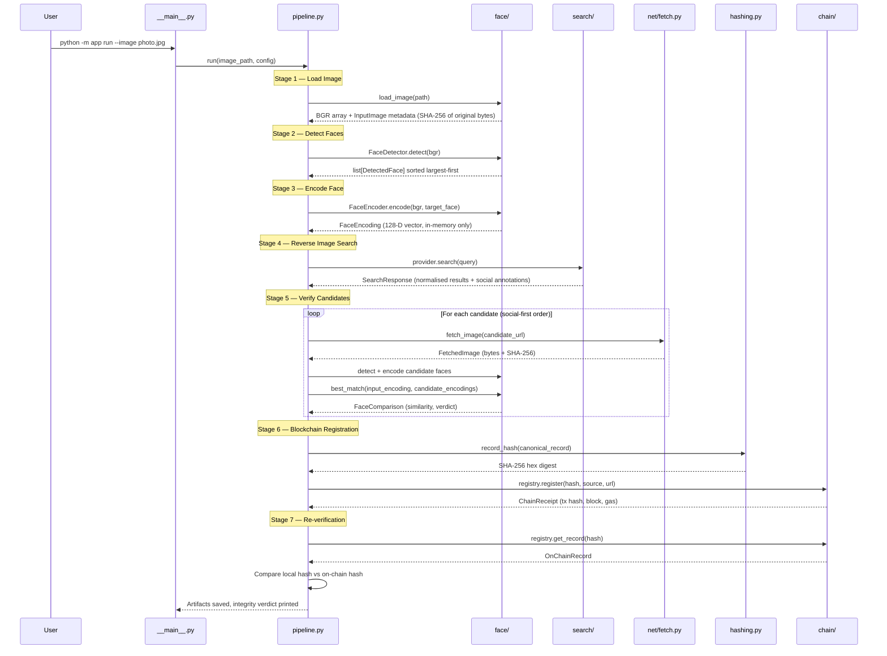
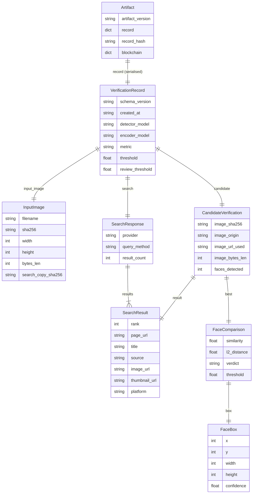

# Face ID + Blockchain Verification

> Detect a face, search the web for it, verify the match, and commit a tamper-proof fingerprint to an Ethereum blockchain — all in a single CLI command.


---

## Table of Contents

- [Overview](#overview)
- [Key Features](#key-features)
- [Tech Stack](#tech-stack)
- [Architecture](#architecture)
- [Project Structure](#project-structure)
- [Core Application Flow](#core-application-flow)
- [Data Model](#data-model)
- [Smart Contract](#smart-contract)
- [Environment Variables](#environment-variables)
- [Installation & Setup](#installation--setup)
- [Usage](#usage)
- [Available Commands](#available-commands)
- [Testing](#testing)
- [Security & Privacy](#security--privacy)
- [Known Limitations](#known-limitations)
- [Future Improvements](#future-improvements)
- [Contributing](#contributing)
- [License](#license)
- [🤖 AI / LLM Context](#-ai--llm-context)

---

## Overview

**Face ID + Blockchain Verification** is a Python CLI pipeline built for **Hacker House Goa 2026 — Shortlisting Task #3**. It demonstrates a complete chain of custody for facial verification data:

1. **Detect** a face in a local image using OpenCV YuNet
2. **Encode** it as a 128-dimensional SFace embedding
3. **Search** the web for visual matches using a genuine reverse-image-search API
4. **Verify** that a discovered candidate image contains the same face
5. **Fingerprint** the entire verification record with SHA-256 over canonical JSON
6. **Commit** the fingerprint to an Ethereum-compatible blockchain
7. **Prove** the record has not been tampered with by re-reading the chain

The project is a technical demonstration of how computer vision, public-web search, deterministic hashing, and blockchain immutability can be composed into a single auditable pipeline. It is aimed at developers, evaluators, and hackathon judges who want to see a real, end-to-end proof-of-concept — not mocked API calls or pre-seeded data.

**Every step is live.** No results are hardcoded, no searches are faked, and no blockchain transactions are pre-baked.

---

## Key Features

| | Feature | Description |
|---|---|---|
| 🧠 | **Face Detection** | YuNet (OpenCV DNN) detects faces in milliseconds — no cmake, dlib, or GPU required |
| 🔐 | **Face Encoding & Matching** | SFace produces 128-D embeddings; cosine similarity with a three-way verdict (MATCH / POSSIBLE MATCH / NO MATCH) using OpenCV's published threshold |
| 🔍 | **Genuine Reverse Image Search** | SerpAPI Google Lens (primary) or Google Cloud Vision WEB_DETECTION (fallback) — live API calls, never cached or pre-seeded |
| 📱 | **Social Media Prioritisation** | Results from X, Reddit, Instagram, Facebook, LinkedIn, TikTok, YouTube, and 15+ platforms are detected by URL and tried first |
| ✅ | **Candidate Face Verification** | Candidate images are downloaded, faces are detected and encoded, and cosine similarity is computed against the input |
| 🔗 | **Blockchain Registration** | SHA-256 of canonical JSON is committed on-chain via a Solidity smart contract on Ethereum Sepolia (or any EVM chain) |
| 🛡️ | **Tamper Detection** | Modify any field in the artifact → recompute the hash → compare with the blockchain → `TAMPER DETECTED` |
| 🏥 | **Pre-flight Diagnostics** | `doctor` command validates API keys, model weights, blockchain connectivity, and wallet balance before a run |
| 🧪 | **66 Offline Unit Tests** | Hashing, serialisation round-trips, matching logic, config validation, social detection — no network or API keys needed |
| 🖥️ | **Clean CLI Output** | Step-by-step terminal output with colour, designed for unedited screen recordings |

---

## Tech Stack

| Layer | Technology | Purpose |
|---|---|---|
| **Language** | Python 3.10+ | Core runtime |
| **Face Detection** | OpenCV 4.12 — `cv2.FaceDetectorYN` (YuNet ONNX) | Millisecond-level face detection, ships in the pip wheel |
| **Face Recognition** | OpenCV 4.12 — `cv2.FaceRecognizerSF` (SFace ONNX) | 128-D face embeddings with published cosine threshold |
| **Reverse Search (Primary)** | SerpAPI Google Lens API | Uploads image privately, returns visual matches with page/image URLs |
| **Reverse Search (Fallback)** | Google Cloud Vision WEB_DETECTION | Inline base64 image, returns pages with matching images |
| **Image Processing** | Pillow ≥ 10.0 | Re-encodes oversized images to fit provider upload limits |
| **HTTP** | Requests ≥ 2.31 | Search API calls, candidate image downloads, model weight downloads |
| **Blockchain** | web3.py 7.16 + Ethereum Sepolia | JSON-RPC, contract interaction, local signing, receipt polling |
| **Smart Contract** | Solidity 0.8.28 — `VerificationRegistry.sol` | Immutable record hash storage, duplicate rejection, event emission |
| **Contract Compilation** | py-solc-x 2.0.5 | Downloads and caches `solc`, no Node/Hardhat/Foundry required |
| **Hashing** | hashlib (stdlib) | SHA-256 over deterministic canonical JSON |
| **Serialisation** | json (stdlib) | Canonical JSON: sorted keys, no whitespace, no NaN, UTF-8 |
| **Configuration** | python-dotenv ≥ 1.0 | `.env` file loading with per-command validation |
| **Testing** | pytest ≥ 8.0 | 66 unit tests, all offline |
| **Array Operations** | NumPy ≥ 1.26 | Face embedding vectors and OpenCV interop |

---

## Architecture



### How Components Communicate

- **CLI → Pipeline**: `__main__.py` parses `argparse` arguments and calls `pipeline.run()`, `pipeline.verify()`, `pipeline.deploy()`, or `pipeline.doctor()`.
- **Pipeline → Face**: The pipeline creates `FaceDetector` and `FaceEncoder` instances, passes the BGR image array, and receives `DetectedFace` / `FaceEncoding` dataclass objects.
- **Pipeline → Search**: A `ReverseImageSearchProvider` (selected by config) receives a `SearchQuery` and returns a `SearchResponse` containing normalised `SearchResult` objects. The social module annotates results with platform labels.
- **Pipeline → Net**: Candidate image URLs are fetched via `net.fetch.fetch_image()`, which enforces SSRF protections and returns `FetchedImage` with a SHA-256 fingerprint.
- **Pipeline → Chain**: The `Registry` class wraps a deployed smart contract instance; it handles `register()` (write) and `get_record()` (read) operations, signing transactions locally.
- **Pipeline → Artifacts**: JSON files are written to `artifacts/` at the end of a successful run.

---

## Project Structure

```
HH-Goa-T3/
├── app/                           # Main Python package
│   ├── __init__.py                # Package metadata, __version__ = "1.0.0"
│   ├── __main__.py                # CLI entry point (argparse: run|verify|deploy|doctor)
│   ├── pipeline.py                # End-to-end 7-stage orchestration
│   ├── config.py                  # .env loading + per-command validation
│   ├── errors.py                  # Typed error hierarchy (15 error classes)
│   ├── models.py                  # All dataclasses: FaceBox → VerificationRecord → Artifact
│   ├── hashing.py                 # Canonical JSON serialisation + SHA-256
│   ├── imaging.py                 # Search copy preparation (downscale to fit upload limits)
│   ├── artifacts.py               # Read/write JSON artifacts to artifacts/
│   ├── ui.py                      # Minimal coloured terminal output
│   ├── face/                      # Computer vision subsystem
│   │   ├── detector.py            # YuNet face detection (cv2.FaceDetectorYN)
│   │   ├── encoder.py             # SFace 128-D encoding (cv2.FaceRecognizerSF)
│   │   ├── matcher.py             # Cosine similarity + 3-way verdict classification
│   │   └── models_store.py        # ONNX model download with SHA-256 verification
│   ├── search/                    # Reverse image search subsystem
│   │   ├── base.py                # ReverseImageSearchProvider abstract interface
│   │   ├── serpapi.py             # SerpAPI Google Lens (primary): upload → search
│   │   ├── google_vision.py       # Google Vision WEB_DETECTION (fallback): inline base64
│   │   ├── registry.py            # Provider factory
│   │   └── social.py              # Social platform detection (20+ platforms) + ranking
│   ├── chain/                     # Blockchain subsystem
│   │   ├── client.py              # Web3 connection + network identification
│   │   ├── compile.py             # Solidity compilation with cached artifacts
│   │   └── registry.py            # Deploy, register, read-back, balance checks
│   └── net/
│       └── fetch.py               # Candidate image download (SSRF-safe, streaming)
├── contracts/
│   └── VerificationRegistry.sol   # Solidity 0.8.28 smart contract
├── tests/                         # 66 offline unit tests (pytest)
│   ├── test_hashing.py            # Canonical JSON, SHA-256, quantisation
│   ├── test_matching.py           # 3-way verdict classification
│   ├── test_serialization.py      # Record round-trip through JSON
│   ├── test_config.py             # Config validation, threshold checks
│   └── test_social.py             # Social platform detection from URLs
├── models/                        # ONNX weights (gitignored, ~39 MB, fetched on first run)
├── samples/                       # Input images (gitignored — biometric data)
│   └── ATTRIBUTION.md             # Guidance on selecting test images
├── artifacts/                     # Pipeline output (gitignored)
├── build/                         # Cached compiled contract ABI/bytecode (gitignored)
├── tools/                         # Local anvil.exe for offline EVM testing (gitignored)
├── requirements.txt               # Pinned Python dependencies
├── .env.example                   # Configuration template with documentation
├── .gitignore                     # Secrets, weights, artifacts, samples excluded
└── README.md                      # This file
```

---

## Core Application Flow

### Full Pipeline (`python -m app run --image photo.jpg`)



### Tamper Detection Flow (`python -m app verify`)

1. Load `artifacts/latest_verification.json`
2. Extract the stored `record` object and `record_hash`
3. Recompute SHA-256 over the `record` using the same canonical serialisation
4. Compare recomputed hash against the stored hash (detects local file modifications)
5. Query the blockchain for both hashes
6. If the recomputed hash matches on-chain → **PASS** (artifact is unmodified)
7. If only the stored hash matches on-chain → **TAMPER DETECTED** (artifact was modified after registration)
8. If neither hash is found on-chain → **FAIL** (never registered, or wrong network)

---

## Data Model



### Key Data Integrity Principles

- **Embeddings never leave memory.** `FaceEncoding.vector` is not serialised, printed, logged, or stored anywhere.
- **The hashed record contains zero biometric data.** Only SHA-256 digests, public URLs, similarity scores, and metadata.
- **Float quantisation** — all floats are rounded to 6 decimal places before entering the record, ensuring JSON round-trip stability.
- **Canonical JSON** — `sort_keys=True`, `separators=(",",":")`, `ensure_ascii=False`, `allow_nan=False` — guarantees one byte-identical representation.

---

## Smart Contract

**`contracts/VerificationRegistry.sol`** — Solidity 0.8.28

```solidity
struct Record {
    bytes32 recordHash;     // SHA-256 of the canonical JSON record
    uint64  blockTimestamp;  // block.timestamp at commitment
    address submitter;       // msg.sender
    string  source;          // platform label (e.g. "Reddit")
    string  candidateUrl;    // public URL of the discovered post
}
```

| Function | Type | Description |
|---|---|---|
| `registerVerification(bytes32, string, string)` | Write | Commit a record hash. Reverts on empty hash or duplicate. |
| `getRecord(bytes32)` | Read | Returns the full `Record`. Reverts if not found. |
| `isRegistered(bytes32)` | Read | Returns `bool`. Never reverts. |
| `recordCount()` | Read | Total number of registered records. |

**Security properties:**
- Records are **immutable once written** — the same hash cannot be re-registered (prevents timestamp/submitter overwriting)
- The contract stores **only** the hash, a platform label, and a URL — no images, no embeddings, no personal data
- No access control on writes — anyone can register a hash (this is intentional for a public verification registry)

---

## Environment Variables

| Variable | Required | Default | Description |
|---|:---:|---|---|
| `SEARCH_PROVIDER` | No | `serpapi` | Search backend: `serpapi` or `google_vision` |
| `SERPAPI_API_KEY` | Yes* | — | SerpAPI key for Google Lens ([free tier: 100/month](https://serpapi.com/users/sign_up)) |
| `GOOGLE_VISION_API_KEY` | Yes* | — | Google Cloud Vision API key ([free tier: 1000/month](https://console.cloud.google.com/apis/credentials)) |
| `RPC_URL` | Yes | — | Ethereum JSON-RPC endpoint |
| `PRIVATE_KEY` | Yes | — | Hex private key of a **throwaway testnet wallet** (with or without `0x` prefix) |
| `CONTRACT_ADDRESS` | Yes | — | Address of deployed `VerificationRegistry` (output of `python -m app deploy`) |
| `FACE_MATCH_THRESHOLD` | No | `0.363` | SFace cosine similarity threshold for MATCH ([published by OpenCV](https://github.com/opencv/opencv_zoo)) |
| `FACE_REVIEW_THRESHOLD` | No | `0.300` | Lower bound for POSSIBLE MATCH band |
| `FACE_DETECT_CONFIDENCE` | No | `0.850` | Minimum YuNet detection confidence |

> \* Only the key for your selected `SEARCH_PROVIDER` is required.

<details>
<summary><strong>.env.example template</strong></summary>

```bash
# --- Reverse Image Search ---
SEARCH_PROVIDER=serpapi
SERPAPI_API_KEY=
GOOGLE_VISION_API_KEY=

# --- Blockchain ---
RPC_URL=https://ethereum-sepolia-rpc.publicnode.com
PRIVATE_KEY=
CONTRACT_ADDRESS=

# --- Face Matching (optional) ---
FACE_MATCH_THRESHOLD=0.363
FACE_REVIEW_THRESHOLD=0.300
FACE_DETECT_CONFIDENCE=0.850
```

</details>

---

## Installation & Setup

### Prerequisites

- **Python 3.10+** with `pip` and `venv`
- **Internet access** for model weights (~39 MB one-time download), API calls, and blockchain RPC
- A **SerpAPI key** (or Google Cloud Vision key) for reverse image search
- A **throwaway Sepolia testnet wallet** funded with ~0.005 ETH

### 1. Clone and Install

```bash
git clone <repo-url>
cd HH-Goa-T3

python -m venv .venv

# Windows
.venv\Scripts\activate

# macOS / Linux
source .venv/bin/activate

pip install -r requirements.txt
```

### 2. Configure Environment

```bash
cp .env.example .env
```

Edit `.env` and fill in:

```ini
SERPAPI_API_KEY=your_serpapi_key_here
PRIVATE_KEY=0xyour_throwaway_testnet_private_key
```

### 3. Get Testnet ETH

Fund your **throwaway** wallet from a Sepolia faucet (you need ~0.005 ETH):

- [Google Cloud Sepolia Faucet](https://cloud.google.com/application/web3/faucet/ethereum/sepolia)
- [Alchemy Sepolia Faucet](https://www.alchemy.com/faucets/ethereum-sepolia)

### 4. Get a SerpAPI Key

Sign up at [serpapi.com](https://serpapi.com/users/sign_up) — free tier gives 100 searches/month. Copy the key to `SERPAPI_API_KEY` in `.env`.

### 5. Deploy the Smart Contract

```bash
python -m app deploy
```

Copy the printed `CONTRACT_ADDRESS` into your `.env`.

### 6. Verify Setup

```bash
python -m app doctor
```

This checks API keys, model weights, blockchain connectivity, and wallet balance.

### 7. Place a Test Image

```bash
cp /path/to/your/photo.jpg samples/input.jpg
```

> **Requirements:** A clear, front-facing photo of someone whose face appears publicly on the web. See `samples/ATTRIBUTION.md` for details.

---

## Usage

### Run the Full Pipeline

```bash
python -m app run --image samples/input.jpg
```

If multiple faces are detected, the largest is used by default. Select a specific face with:

```bash
python -m app run --image samples/input.jpg --face 0
```

### Verify a Stored Record

```bash
python -m app verify
```

Or verify a specific artifact file:

```bash
python -m app verify --record path/to/verification.json
```

### Tamper Demonstration

1. Run the pipeline: `python -m app run --image samples/input.jpg`
2. Open `artifacts/latest_verification.json`
3. Change any value (e.g., `"similarity": 0.45` → `"similarity": 0.99`)
4. Run: `python -m app verify`
5. Output: **`TAMPER DETECTED`** — the recomputed hash no longer matches the blockchain

### Pre-flight Diagnostics

```bash
python -m app doctor
```

### Deploy a New Contract

```bash
python -m app deploy
```

---

## Available Commands

| Command | Purpose |
|---|---|
| `python -m app run --image <path> [--face <index>]` | Full pipeline: detect → search → verify → chain → check |
| `python -m app verify [--record <path>]` | Re-verify an artifact against the blockchain |
| `python -m app deploy` | Compile and deploy a fresh `VerificationRegistry` contract |
| `python -m app doctor` | Pre-flight checks: API keys, models, chain, wallet balance |
| `python -m app --version` | Print version (currently `1.0.0`) |
| `python -m pytest tests/ -v` | Run 66 offline unit tests |

---

## Testing

```bash
python -m pytest tests/ -v
```

**66 tests** across 5 test modules. All run offline — no API keys, no network, no blockchain required.

| Module | Tests | What It Covers |
|---|---:|---|
| `test_hashing.py` | 15 | Canonical JSON byte-pinning, SHA-256, float quantisation, `to_bytes32`, determinism, NaN rejection |
| `test_serialization.py` | 10 | `VerificationRecord.to_record()`, artifact round-trip, schema version, no-embedding-in-record, hash stability |
| `test_config.py` | 8 | Threshold validation, per-command `require_*` checks, private key normalisation, invalid provider |
| `test_matching.py` | 9 | Three-way verdict classification at and around thresholds, OpenCV constant pinning |
| `test_social.py` | 14 | Platform detection for 10+ social platforms, subdomain handling, prioritisation ordering |

### What Is Not Tested

- **End-to-end integration** requires live API keys and a funded wallet, so there are no automated integration tests. The `doctor` command serves as a manual pre-flight check.
- **Face detection/encoding** depends on ONNX model weights and is tested via the pipeline itself, not mocked in unit tests.

---

## Security & Privacy

### Security Measures

| Area | Implementation |
|---|---|
| **SSRF protection** | `net/fetch.py` rejects URLs resolving to private, loopback, link-local, or reserved IP ranges |
| **Private key handling** | Key never leaves the process, never logged, never serialised; transactions are signed locally |
| **Model integrity** | Downloaded ONNX weights are verified against pinned SHA-256 digests after download |
| **Secrets management** | `.env` is gitignored; `.env.example` contains no real values |
| **Candidate image limits** | Max 12 MB download, streaming with early abort, content-type validation |
| **Input validation** | Config thresholds, file existence, image decodability, contract address checksumming — all validated up front |
| **Error hierarchy** | 15 typed error classes ensure every failure mode produces a readable message, not a raw traceback |

### Privacy Properties

- Face embeddings exist **in memory only** during execution — they are never serialised, logged, stored, or transmitted
- The blockchain record contains **no images, no embeddings, no biometric data, and no personal information**
- The pipeline does **not** bypass authentication, CAPTCHAs, or access controls
- The pipeline does **not** access private profiles or paywalled content
- The pipeline does **not** claim to identify real-world individuals

### What Blockchain Proves (and Does Not Prove)

- ✅ The recorded data has not changed since it was committed at a specific block timestamp
- ❌ The underlying face match was correct
- ❌ The search result was meaningful
- ❌ The person in the image is who anyone says they are

---

## Known Limitations

> This section is intentionally thorough. Honest documentation makes the project more credible, not less.

- **Face similarity ≠ identity.** Cosine similarity tells you two face crops scored above a threshold. It does not establish who a person is.
- **Reverse-image search depends on provider indexing.** If an image has never been indexed by Google, the search returns no results. This is a property of the search engine, not a bug.
- **Social platforms may block automated image access.** CDNs commonly block hotlinking. The pipeline tries multiple URLs per candidate and reports failures.
- **False positives and false negatives exist.** No face recognition model is perfect. SFace's threshold was chosen by the model authors.
- **Public testnets are not production infrastructure.** Sepolia may reorganise, be deprecated, or experience downtime.
- **The 500 KB SerpAPI upload limit** means large images are re-encoded. The input fingerprint always refers to the original file; the search copy's digest is recorded separately.
- **No web UI.** This is a CLI-only tool.
- **Single-run, not a service.** Each invocation performs one search and one blockchain registration. There is no persistent daemon or API server.

---

## Future Improvements

These are **not currently implemented**. They are realistic extensions of the current architecture:

- **Batch processing** — process multiple images in sequence with a summary report
- **Multi-chain support** — deploy to Base, Polygon, or other EVM chains (the code already supports any EVM via chain ID detection)
- **Web UI** — a Streamlit or Flask interface for non-CLI users
- **Embedding storage option** — opt-in encrypted local storage for re-verification without re-encoding
- **Automated integration tests** — using a local Anvil node and mocked search responses
- **IPFS artifact pinning** — store the full verification artifact on IPFS alongside the chain hash
- **Webhook notifications** — post results to Slack, Discord, or a webhook endpoint

---

## Contributing

1. **Fork** the repository
2. **Create a branch**: `git checkout -b feature/your-feature`
3. **Install dependencies**: `pip install -r requirements.txt`
4. **Make changes** and ensure tests pass: `python -m pytest tests/ -v`
5. **Commit** with a descriptive message
6. **Push** and open a **Pull Request**

### Code Conventions

- All pipeline errors are subclasses of `PipelineError` (see `app/errors.py`)
- Data between stages flows as frozen dataclasses (see `app/models.py`)
- No business logic in `__main__.py` — it only parses arguments and dispatches
- Face embeddings must never appear in any serialised output

---

## License

The existing README states MIT. No standalone `LICENSE` file is present in the repository.

---

## 🤖 AI / LLM Context

> This section provides a compact technical map of the repository, designed so an AI coding assistant can understand the project quickly and make accurate changes.

### Project Intent

A **CLI pipeline** that chains computer vision (face detection + recognition), live reverse-image-search APIs, deterministic hashing, and Ethereum smart contract interaction into a single auditable verification flow. Built as a hackathon submission (Hacker House Goa 2026, Task #3).

### Architecture at a Glance

```
CLI (argparse) → pipeline.py orchestrator → {face/, search/, chain/, net/} subsystems → artifacts/ output
```

- **No web server, no database, no frontend.** Pure CLI tool.
- **No global state.** `Config` is loaded once and passed to every function.
- **Data flows as frozen dataclasses** defined in `models.py`.

### Source of Truth

| Concern | Location |
|---|---|
| CLI argument parsing | `app/__main__.py` |
| Pipeline orchestration (the 7 stages) | `app/pipeline.py` |
| All dataclasses (15+) | `app/models.py` |
| Configuration + validation | `app/config.py` |
| Error types (15 classes) | `app/errors.py` |
| Canonical hashing (SHA-256) | `app/hashing.py` |
| Face detection | `app/face/detector.py` — `FaceDetector` class |
| Face encoding | `app/face/encoder.py` — `FaceEncoder` class |
| Face comparison logic | `app/face/matcher.py` — `classify()`, `best_match()` |
| ONNX model download + verification | `app/face/models_store.py` |
| Search provider interface | `app/search/base.py` — `ReverseImageSearchProvider` ABC |
| SerpAPI implementation | `app/search/serpapi.py` |
| Google Vision implementation | `app/search/google_vision.py` |
| Social platform detection | `app/search/social.py` — URL → platform mapping |
| Candidate image download | `app/net/fetch.py` — SSRF-safe streaming fetch |
| Web3 connection + network ID | `app/chain/client.py` |
| Solidity compilation | `app/chain/compile.py` |
| Contract deploy/register/read | `app/chain/registry.py` — `Registry` class |
| Smart contract source | `contracts/VerificationRegistry.sol` |
| Artifact I/O | `app/artifacts.py` |
| Terminal output | `app/ui.py` |

### Important Files (Ranked by Impact)

1. **`app/pipeline.py`** — The orchestrator. All 7 stages are here. This is the file to read first.
2. **`app/models.py`** — Every data structure in the system. `VerificationRecord.to_record()` defines the exact shape that gets hashed and committed.
3. **`app/hashing.py`** — The root of the integrity claim. `canonical_json()` + `record_hash()` must stay stable; changing them changes every hash.
4. **`app/config.py`** — All env vars, defaults, and per-command validation. `Config.load()` is called once at startup.
5. **`app/chain/registry.py`** — The `Registry` class handles all blockchain I/O (deploy, register, read).
6. **`contracts/VerificationRegistry.sol`** — The smart contract. Small (~80 lines) but critical.

### Data Flow

```
Image file on disk
  → bytes SHA-256 (input fingerprint)
  → OpenCV decode → BGR array
  → YuNet detection → DetectedFace[]
  → SFace alignment+encoding → FaceEncoding (128-D, memory only)
  → Search provider API → SearchResult[] (normalised, social-annotated)
  → For each candidate: fetch image → detect faces → encode → cosine compare
  → VerificationRecord.to_record() → dict
  → canonical_json(dict) → bytes
  → SHA-256(bytes) → hex digest
  → Smart contract registerVerification(bytes32 hash, string source, string url)
  → On-chain read-back → hash comparison → PASS / FAIL / TAMPER DETECTED
  → Artifacts written to disk (JSON)
```

### Business Rules

- **Embeddings never leave memory.** `FaceEncoding.__repr__` deliberately hides the vector. No serialisation path exists.
- **Social results are tried first** in candidate verification (see `social.prioritise()`).
- **Both publisher image URL and provider thumbnail URL are tried** per candidate, in that order.
- **A `MATCH` requires similarity ≥ `match_threshold` (default 0.363)**. Between `review_threshold` and `match_threshold` → `POSSIBLE MATCH`. Below → `NO MATCH`.
- **Float quantisation (`round(x, 6)`)** is applied to all floats before they enter the hashed record, ensuring JSON round-trip stability.
- **Duplicate record hashes are rejected** by the smart contract (`RecordAlreadyExists` revert).
- **The verify command compares two hashes**: (1) stored vs recomputed (local integrity), (2) recomputed vs on-chain (blockchain integrity).

### Extension Points

| To Add | Where to Change |
|---|---|
| A new CLI command | Add a subparser in `__main__.py`, add a function in `pipeline.py` |
| A new search provider | Subclass `ReverseImageSearchProvider` in `search/`, register it in `search/registry.py` |
| A new social platform | Add the domain → label mapping in `search/social.py._PLATFORMS` |
| A new data field to the record | Update `VerificationRecord.to_record()` in `models.py` — **bump `SCHEMA_VERSION`** |
| A new error type | Subclass `PipelineError` in `errors.py` with a unique `kind` string |
| Multi-chain support | Already works — `chain/client.py` identifies any chain ID. Add explorer URLs to `_KNOWN` dict. |
| Local EVM testing | Run `tools/anvil.exe` (Foundry Anvil), set `RPC_URL=http://127.0.0.1:8545` |

### Important Caveats for AI Agents

1. **`hashing.py` is stability-critical.** Never change `canonical_json()` serialisation rules or `quantize()` precision — doing so silently breaks every existing hash.
2. **`VerificationRecord.to_record()` is the canonical record shape.** Adding or removing fields changes the hash. Bump `SCHEMA_VERSION` if the shape must change.
3. **The `models/` directory is gitignored.** ONNX weights (~39 MB) are downloaded on first run by `models_store.py`. Don't commit them.
4. **The `artifacts/` directory is gitignored.** Pipeline outputs are regenerated on each run.
5. **The `samples/` directory is gitignored** because face images are biometric data.
6. **The `.env` file contains real secrets** (API keys, private keys). Never read or log its contents. Use `.env.example` for documentation.
7. **`ui.py` is output-only.** It prints to stdout with optional ANSI colour. It has no state, no input handling, and no dependencies.
8. **Provider responses are never cached or mocked** in production code. Every `search()` call hits a live API.
9. **The smart contract uses custom errors** (`EmptyRecordHash`, `RecordAlreadyExists`, `RecordNotFound`), not `require()` strings. The Python side catches `ContractCustomError` and `ContractLogicError`.
10. **`tools/anvil.exe`** is a local Foundry Anvil binary for offline EVM testing. It is gitignored and not required for normal operation.

---

<p align="center">
  <em>Built for Hacker House Goa 2026 — Task #3</em>
</p>
