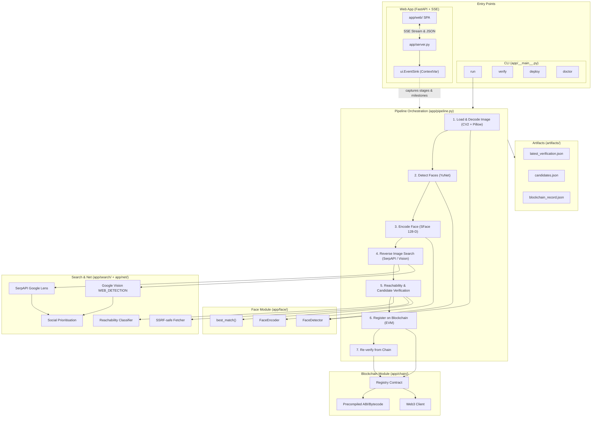
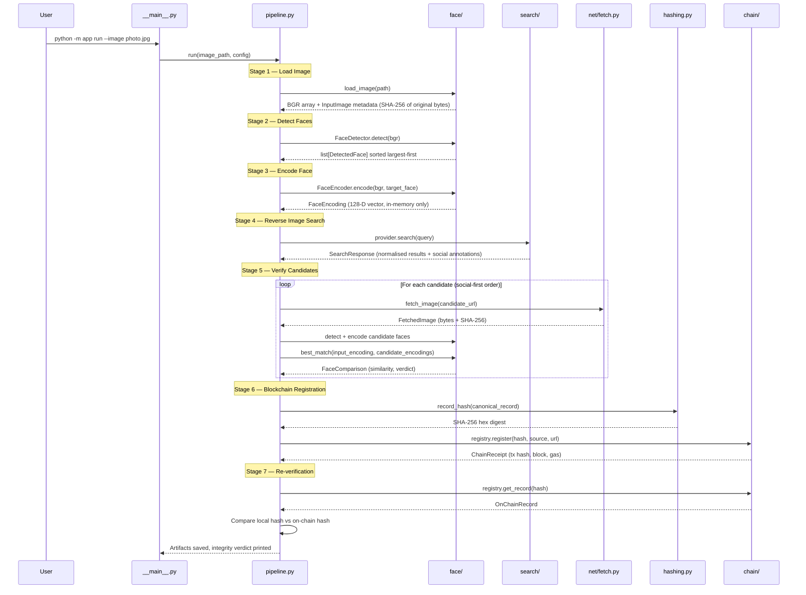
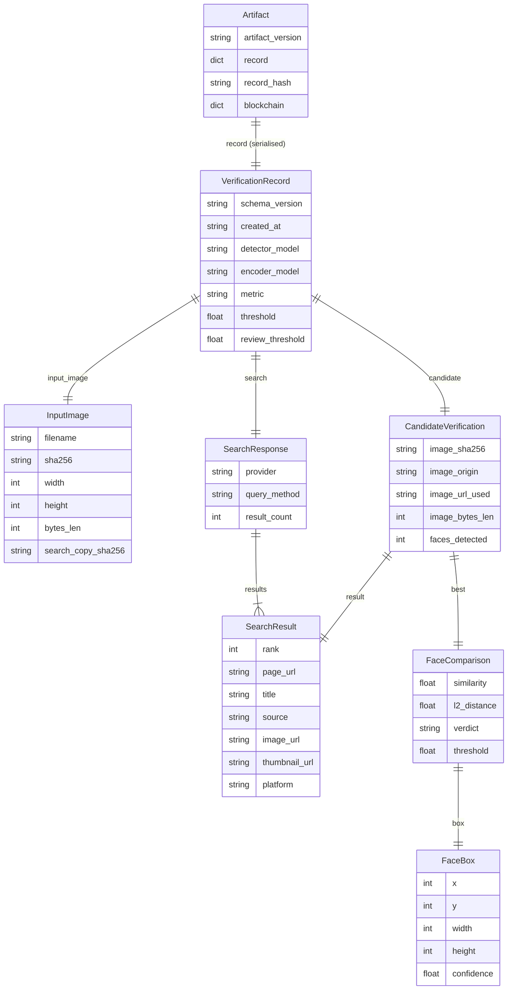

# Face ID + Blockchain Verification

> Detect a face, search the web for it, verify the match, and commit a tamper-proof fingerprint to an Ethereum blockchain — all in a single CLI command or interactive web app.


---

## Table of Contents

- [Overview](#overview)
- [Key Features](#key-features)
- [Tech Stack](#tech-stack)
- [Multi-Source Provenance & Deterministic Ranking](#multi-source-provenance--deterministic-ranking)
- [Blockchain Idempotency & Gas Economics](#blockchain-idempotency--gas-economics)
- [Technical Pipeline Inspector (Evaluator Tool)](#technical-pipeline-inspector-evaluator-tool)
- [Architecture](#architecture)
- [Project Structure](#project-structure)
- [Core Application Flow](#core-application-flow)
- [Web Application & Live Streaming](#web-application--live-streaming)
- [Data Model](#data-model)
- [Smart Contract](#smart-contract)
- [Environment Variables](#environment-variables)
- [Installation & Setup](#installation--setup)
- [Usage](#usage)
- [Available Commands](#available-commands)
- [Deployment (Render)](#deployment-render)
- [Testing](#testing)
- [Security & Privacy](#security--privacy)
- [Known Limitations](#known-limitations)
- [Future Improvements](#future-improvements)
- [Contributing](#contributing)
- [License](#license)
- [🤖 AI / LLM Context](#-ai--llm-context)

---

## Overview

**Face ID + Blockchain Verification** is a Python CLI pipeline built for **Hacker House Goa 2026 — Shortlisting Task #3**. It demonstrates a complete chain of custody for facial verification data:

1. **Detect** a face in a local image using OpenCV YuNet
2. **Encode** it as a 128-dimensional SFace embedding
3. **Search** the web for visual matches using a genuine reverse-image-search API
4. **Verify** discovered candidates across multiple sources (probing up to 10 candidates)
5. **Deterministically Rank** the primary source based on similarity, reachability, image origin, and rank
6. **Fingerprint** the entire verification record with SHA-256 over canonical JSON
7. **Commit** the fingerprint to an Ethereum-compatible blockchain with built-in idempotency
8. **Prove** the record has not been tampered with by re-reading the chain

The project is a technical demonstration of how computer vision, public-web search, deterministic hashing, and blockchain immutability can be composed into a single auditable pipeline. It is aimed at developers, evaluators, and hackathon judges who want to see a real, end-to-end proof-of-concept — not mocked API calls or pre-seeded data.

**Every step is live.** No results are hardcoded, no searches are faked, and no blockchain transactions are pre-baked.

---

## Key Features

| | Feature | Description |
|---|---|---|
| 🌐 | **Web UI & Live Streaming** | Single-page app with drag-and-drop upload, 7-stage progress rail, categorized terminal console, and live SSE streaming |
| 🌌 | **Ghost Fibers WebGL Canvas** | GPU-accelerated WebGL2 background with calm biometric wave physics and high-contrast atmospheric depth |
| 🎨 | **Refined Typography & Colors** | Strict semantic hierarchy: soft white (`#F5F3FF`), lavender (`#B8B4C9`), neon coral (`#FF4D6D`), and mint (`#35E0A1`) |
| 🖥️ | **Terminal Scorecard & Demo** | `python -m app demo` with box-drawing visual scorecard, Unicode border metrics, and stage audit tables |
| 🔍 | **Technical Pipeline Inspector** | Dedicated evaluator tool modal exposing raw canonical JSON, cryptographic hash derivation, face geometry, and contract links |
| 🗂️ | **Multi-Source Provenance** | Probes up to 10 candidates; records all validated matches in `validated_sources`; clearly separates discovered vs. validated sources |
| ⚖️ | **Deterministic Primary Ranking** | Solves source volatility (e.g. Bill Gates NYT vs Instagram) using a deterministic 5-tier key (similarity bucket, link status, origin, rank, URL) |
| 🔗 | **LinkedIn Redirect Resolution** | `extract_profile_url` unwraps Google redirects and search query params to produce direct, clickable social profile links |
| ⛽ | **Blockchain Idempotency** | Checks on-chain registry before broadcasting; identical verified images reuse existing anchors without redundant gas or contract reverts |
| 🛡️ | **Render 512MB RAM Safety** | Explicit `del arr` memory releases, resolution downscaling, and `MAX_CONCURRENT_JOBS=1` execution locks prevent OOM crashes |
| 🖼️ | **Universal Image Support** | OpenCV-first with Pillow fallback & EXIF transpose: supports JPEG, PNG, WebP, BMP, TIFF, GIF, AVIF, and iPhone HEIC/HEIF |
| 🔗 | **Link Liveness & Reachability** | Concurrent SSRF-safe link classification (HEAD→GET fallback) detects live pages, login walls, and dead links to prioritise evidence |
| 🧠 | **Face Detection** | YuNet (OpenCV DNN) detects faces in milliseconds — no cmake, dlib, or GPU required |
| 🔐 | **Face Encoding & Matching** | SFace produces 128-D embeddings; cosine similarity with a three-way verdict (MATCH / POSSIBLE MATCH / NO MATCH) |
| 🔍 | **Genuine Reverse Image Search** | SerpAPI Google Lens (primary) or Google Cloud Vision WEB_DETECTION (fallback) — live API calls, never cached or pre-seeded |
| 📱 | **Social Media Prioritisation** | Results from X, Reddit, Instagram, Facebook, LinkedIn, TikTok, YouTube, and 15+ platforms are detected by URL and tried first |
| ✅ | **Candidate Face Verification** | Candidate images are downloaded, faces are detected and encoded, and cosine similarity is computed against the input |
| 🔗 | **Blockchain Registration** | SHA-256 of canonical JSON is committed on-chain via a Solidity smart contract on Ethereum Sepolia (or any EVM chain) |
| 🛡️ | **Tamper Detection** | Modify any field in the artifact → recompute the hash → compare with the blockchain → `TAMPER DETECTED` (available in CLI and Web UI) |
| 🏥 | **Pre-flight Diagnostics** | `doctor` command validates API keys, model weights, blockchain connectivity, and wallet balance before a run |
| 🧪 | **139 Offline Unit Tests** | Hashing, multi-source ranking, idempotency, serialisation, matching, reachability, social URLs, and server SSE — 100% passing |

---

## Tech Stack

| Layer | Technology | Purpose |
|---|---|---|
| **Language** | Python 3.10+ | Core runtime |
| **Web Server** | FastAPI ≥ 0.111 + Uvicorn ≥ 0.30 | Async backend, staged uploads, SSE live progress streaming |
| **Web Frontend** | Vanilla HTML5 / CSS3 / ES6 JS + WebGL2 | Zero-build dark mode UI with Ghost Fibers shader, gauge animations, stage rail |
| **Face Detection** | OpenCV 4.12 — `cv2.FaceDetectorYN` (YuNet ONNX) | Millisecond-level face detection, ships in headless wheel |
| **Face Recognition** | OpenCV 4.12 — `cv2.FaceRecognizerSF` (SFace ONNX) | 128-D face embeddings with published cosine threshold |
| **Reverse Search (Primary)** | SerpAPI Google Lens API | Uploads image privately, returns visual matches with page/image URLs |
| **Reverse Search (Fallback)** | Google Cloud Vision WEB_DETECTION | Inline base64 image, returns pages with matching images |
| **Image Processing** | Pillow ≥ 12.0 + pillow-heif ≥ 1.0 | Universal decoder (AVIF, HEIC, GIF) + downscaling for upload limits |
| **Network & Reachability** | Requests ≥ 2.31 + SSRF protection | Candidate image fetch and concurrent link liveness classification |
| **Blockchain** | web3.py 7.16 + Ethereum Sepolia | JSON-RPC, contract interaction, local signing, receipt polling |
| **Smart Contract** | Solidity 0.8.28 — `VerificationRegistry.sol` | Immutable record hash storage, duplicate rejection, event emission |
| **Contract Artifacts** | Committed `VerificationRegistry.json` | Precompiled ABI and bytecode (zero compiler needed at runtime) |
| **Hashing & Security** | hashlib (stdlib) + canonical JSON | Deterministic SHA-256 digests over sorted, whitespace-free JSON |
| **Configuration** | python-dotenv ≥ 1.0 | `.env` file loading with per-command validation |
| **Testing** | pytest ≥ 8.0 + httpx ≥ 0.28 | 139 offline unit and server tests |
| **Array Operations** | NumPy ≥ 1.26 | Face embedding vectors and OpenCV interop |

---

## Multi-Source Provenance & Deterministic Ranking

In real-world web environments, an image often appears across dozens of platforms simultaneously (news publishers, social networks, blogs, forums). A naive verification pipeline that breaks on the first match is inherently non-deterministic because network latency, bot-blocking, and rate-limiting cause different URLs to be attempted first on different runs.

### The Bill Gates Discrepancy & Root Cause

During initial evaluations on a test portrait of Bill Gates:
- **Run 1** selected **The New York Times** (`https://www.nytimes.com/...`) as the verified source.
- **Run 2** selected **Instagram** (`https://www.instagram.com/...`) as the verified source.

**Root-Cause Analysis:**
Google Lens returned 59 candidate pages for the image (NYT ranked #1 & #2; Instagram ranked #9). The legacy pipeline attempted reachability checks and verified candidates sequentially, breaking on the very first match:
1. Instagram's anti-bot defenses intermittently returned `401 Unauthorized` / `403 Forbidden` on lightweight HEAD probes, classifying it as a `login_wall` (secondary priority). NYT returned `200 OK` (live), so NYT was probed first and matched.
2. When Instagram returned `200 OK` on a subsequent run, the social prioritizer promoted it to Tier 0, probing it before NYT and matching first.

### The Multi-Source Architecture

The pipeline now implements a **multi-candidate probe with deterministic primary selection**:
1. **Multi-Candidate Probing**: Instead of short-circuiting on the first match, Stage 5 evaluates up to 10 top candidate pages, downloading images, detecting faces, and encoding embeddings.
2. **Comprehensive Audit Collection**: Every candidate that passes facial similarity verification is collected into `validated_sources` and recorded in `artifacts/candidates.json` and `latest_verification.json`.
3. **Deterministic Primary Selection**: The primary candidate (committed as the primary reference on-chain) is chosen using a strict 5-tier key:
   - **Tier 1 — Similarity Bucket**: Cosine similarity rounded to 2 decimals (`round(sim, 2)`) to group statistically indistinguishable face matches. Higher similarity dominates.
   - **Tier 2 — Link Usability**: `live` (3) > `login_wall` (2) > `unknown` (1) > `dead` (0). Prefer sources a human evaluator can immediately open without authentication.
   - **Tier 3 — Image Origin**: Direct publisher image (1) > search provider thumbnail (0).
   - **Tier 4 — Search Engine Relevance Rank**: Lower rank number (e.g. rank 1 from Google Lens) preferred.
   - **Tier 5 — Lexicographical Tie-Breaker**: Page URL alphabetically.

This guarantees that identical inputs always produce the identical primary source and identical cryptographic record hash, while surfacing all secondary confirmed sources in the UI and audit artifacts.

---

## Blockchain Idempotency & Gas Economics

### Idempotency Protection

Writing records to Ethereum Sepolia costs gas and takes 1-3 blocks (~15-45 seconds). In production:
- Re-submitting the same image or same record hash must **never** broadcast a duplicate transaction.
- Attempting to re-register the same `bytes32 recordHash` on `VerificationRegistry.sol` would revert with `AlreadyRegistered(bytes32)`.

**Implementation:**
1. **On-Chain Pre-Check**: Before broadcasting any transaction, `_blockchain_register` calls `registry.get_record(rec_hash)`. If a record already exists on-chain, the pipeline logs the existing block timestamp and submitter address, returns the confirmed receipt with `idempotent=True`, and consumes **0 gas**.
2. **Deterministic Artifact Continuity**: When verifying an image whose file digest (`sha256`) matches the most recent verification artifact, the original `created_at` timestamp is preserved, keeping `record_hash` stable and triggering idempotent retrieval.

### Wallet Funding & Gas Analysis

Live evaluation wallet: `0x72540F38B3ff3A0423B7DF9d88fE6F70329b1677` on Ethereum Sepolia:
- **Balance**: `0.327949 ETH`
- **Cost per verification**: ~167,000 gas at ~1.04 Gwei base fee = ~0.000174 ETH ($0.00 on testnet).
- **Capacity**: The wallet holds sufficient testnet ETH for **~1,885 on-chain verifications**, eliminating any risk of evaluation failure during multi-day testing.

---

## Technical Pipeline Inspector (Evaluator Tool)

To provide 100% transparency for hackathon evaluators and technical judges, the web interface includes a **Technical Pipeline Inspector** modal accessible via the `Inspector` button in the header.

### Features:
- **Canonical JSON Viewer**: Formatted, syntax-highlighted display of the exact JSON payload hashed by the pipeline. Includes a one-click "Copy JSON" button.
- **Cryptographic Hash Pipeline**: Step-by-step visual mapping:
  $$\text{Input Image} \rightarrow \text{YuNet Face Detection} \rightarrow \text{SFace 128-D Embedding} \rightarrow \text{Canonical JSON} \rightarrow \text{SHA-256 Digest} \rightarrow \text{Sepolia Contract}$$
- **Smart Contract & Network Parameters**: Live link to the verified contract on Sepolia Etherscan (`0x58159AAC8d811FBb92A050fD3F4dA702DBD9f3ae`), Solidity method signatures, and idempotency status.
- **Biometrics & Model Geometry**: Bounding box coordinates `(x, y, width, height)` of the target face, detection confidence, and cosine similarity metric.
- **Render 512MB RAM Budget**: Operational specifications documenting how memory limits are respected.

### Evaluator API Endpoints:
- `GET /api/pipeline-info` — JSON endpoint exposing active contract address, network chain ID, model versions, similarity thresholds, and memory bounds.
- `GET /api/latest-artifact` — Returns the raw verification artifact JSON currently saved on disk.

---

## Architecture



### How Components Communicate

- **CLI → Pipeline**: `__main__.py` parses `argparse` arguments and calls `pipeline.run()`, `pipeline.verify()`, `pipeline.deploy()`, or `pipeline.doctor()`.
- **Web UI → Server → Pipeline**: `app/server.py` exposes `/api/jobs` for staged file uploads and `/api/jobs/{id}/stream` for Server-Sent Events (SSE). It executes `pipeline.run()` in a bounded `ThreadPoolExecutor`, capturing every `ui.*` call via a `ContextVar`-isolated `EventSink` to push real-time stage progress and structured milestone events to the browser.
- **Pipeline → Face**: The pipeline creates `FaceDetector` and `FaceEncoder` instances, routes image decoding through universal `decode_to_bgr()`, and receives `DetectedFace` / `FaceEncoding` dataclass objects.
- **Pipeline → Search & Net**: A `ReverseImageSearchProvider` returns normalised `SearchResult` objects. `app/net/reachability.py` classifies candidate URLs concurrently (HEAD→GET fallback, login-walls, dead links) with SSRF safety so social and live links are verified first.
- **Pipeline → Chain**: The `Registry` class wraps the deployed smart contract instance using precompiled artifacts (`contracts/build/VerificationRegistry.json`); it signs registration transactions locally and reads back immutable block receipts.
- **Pipeline → Artifacts**: JSON verification records and candidate metadata are saved to `artifacts/` at the conclusion of a successful run.

---

## Project Structure

```
HH-Goa-T3/
├── app/                           # Main Python package
│   ├── __init__.py                # Package metadata, __version__ = "1.2.0"
│   ├── __main__.py                # CLI entry point (run|demo|verify|deploy|doctor|download-models|precompile)
│   ├── demo.py                    # Formatted terminal scorecard & box-drawing demo runner
│   ├── pipeline.py                # End-to-end 7-stage orchestration with milestone events
│   ├── config.py                  # .env loading + per-command validation
│   ├── errors.py                  # Typed error hierarchy (15 error classes)
│   ├── models.py                  # All dataclasses: FaceBox → VerificationRecord → Artifact
│   ├── hashing.py                 # Canonical JSON serialisation + SHA-256
│   ├── imaging.py                 # Universal decoder (CV2 + Pillow/AVIF/HEIC) + search downscale
│   ├── artifacts.py               # Read/write JSON artifacts to artifacts/
│   ├── ui.py                      # Terminal output + ContextVar sink delegation
│   ├── server.py                  # FastAPI backend with SSE streaming & heartbeat
│   ├── web/                       # Zero-build SPA frontend
│   │   ├── index.html             # UI layout: upload dropzone, 7-stage rail, gauge, console
│   │   ├── styles.css             # Dark theme, glassmorphism, responsive styles
│   │   ├── fibers.js              # Ghost Fibers WebGL2 GPU shader background
│   │   ├── app.js                 # Fetch-based SSE parser, canvas face overlay, tamper demo
│   │   └── fonts/                 # Clash Display typography web font assets
│   ├── face/                      # Computer vision subsystem
│   │   ├── detector.py            # YuNet face detection (cv2.FaceDetectorYN)
│   │   ├── encoder.py             # SFace 128-D encoding (cv2.FaceRecognizerSF)
│   │   ├── matcher.py             # Cosine similarity + 3-way verdict classification
│   │   └── models_store.py        # ONNX model download with SHA-256 verification
│   ├── search/                    # Reverse image search subsystem
│   │   ├── base.py                # ReverseImageSearchProvider abstract interface
│   │   ├── serpapi.py             # SerpAPI Google Lens (primary): upload → search
│   │   ├── google_vision.py       # Google Vision WEB_DETECTION (fallback): inline base64
│   │   ├── registry.py            # Provider factory
│   │   └── social.py              # Social platform detection (20+ platforms) + URL unwrap
│   ├── chain/                     # Blockchain subsystem
│   │   ├── client.py              # Web3 connection + network identification
│   │   ├── compile.py             # 3-tier contract resolution (artifact → cache → solcx)
│   │   └── registry.py            # Deploy, register, read-back, balance checks
│   └── net/
│       ├── fetch.py               # Candidate image download (SSRF-safe, streaming)
│       └── reachability.py        # Concurrent link liveness & status classifier
├── contracts/
│   ├── VerificationRegistry.sol   # Solidity 0.8.28 smart contract
│   └── build/
│       └── VerificationRegistry.json # Precompiled contract artifact (ABI + bytecode)
├── tests/                         # 139 offline unit & integration tests (pytest)
│   ├── test_hashing.py            # Canonical JSON, SHA-256, quantisation
│   ├── test_imaging_decode.py     # Universal image decoders, EXIF transpose, downscale
│   ├── test_matching.py           # 3-way verdict classification
│   ├── test_reachability.py       # Link status classification, HEAD->GET, SSRF safety
│   ├── test_serialization.py      # Record round-trip through JSON
│   ├── test_server.py             # FastAPI upload, SSE streaming, error events, verify
│   ├── test_config.py             # Config validation, threshold checks
│   ├── test_social.py             # Social platform detection & URL redirect extraction
│   ├── test_demo_formatting.py    # Box-drawing Unicode metrics, scorecard table layout
│   └── test_multi_source_and_idempotency.py # Multi-source ranking & blockchain idempotency
├── models/                        # ONNX weights (gitignored, ~39 MB, fetched on first run)
├── samples/                       # Input images (gitignored — biometric data)
│   └── ATTRIBUTION.md             # Guidance on selecting test images
├── artifacts/                     # Pipeline output (gitignored)
├── build/                         # Cached compiled contract ABI/bytecode (gitignored)
├── tools/                         # Local anvil.exe for offline EVM testing (gitignored)
├── conftest.py                    # Root pytest test configuration
├── pytest.ini                     # Pytest defaults and test paths
├── requirements.txt               # Pinned Python production dependencies
├── requirements-dev.txt           # Development & testing dependencies
├── render.yaml                    # Render Blueprint deployment specification
├── render-build.sh                # Render build script (pip install + model download)
├── .env.example                   # Configuration template with documentation
├── .gitignore                     # Secrets, weights, artifacts, samples excluded
└── README.md                      # This file
```

---

## Core Application Flow

### Full Pipeline (`python -m app run --image photo.jpg`)



### Tamper Detection Flow (`python -m app verify`)

1. Load `artifacts/latest_verification.json`
2. Extract the stored `record` object and `record_hash`
3. Recompute SHA-256 over the `record` using the same canonical serialisation
4. Compare recomputed hash against the stored hash (detects local file modifications)
5. Query the blockchain for both hashes
6. If the recomputed hash matches on-chain → **PASS** (artifact is unmodified)
7. If only the stored hash matches on-chain → **TAMPER DETECTED** (artifact was modified after registration)
8. If neither hash is found on-chain → **FAIL** (never registered, or wrong network)

---

## Web Application & Live Streaming

The repository includes a modern single-page web application (`app/web/`) backed by an asynchronous FastAPI server (`app/server.py`). It provides a visual, real-time frontend for the 7-stage verification pipeline.

### Starting the Web Server

Run with Uvicorn:

```bash
uvicorn app.server:app --reload --host 127.0.0.1 --port 8000
```

Then open [http://127.0.0.1:8000](http://127.0.0.1:8000) in your browser.

### Key Web Features

- 📤 **Drag-and-Drop Staging**: Upload any portrait format (JPEG, PNG, WebP, AVIF, HEIC/HEIF). Files are validated, capped at 15 MB, and staged with temporary single-use UUIDs.
- 🚊 **7-Stage Live Rail**: Tracks progress step-by-step through the pipeline: Load Image → Detect Faces → Encode Face → Reverse Search → Verify Candidates → Blockchain Registration → Verification.
- 📟 **Embedded Live Console**: Streams colored log entries (`ok`, `info`, `warn`, `kv` tables) matching the terminal CLI output byte-for-byte.
- 🎯 **Face Bounding Box Overlay**: Renders detected face coordinates directly onto the input image canvas.
- 📊 **Animated Similarity Gauge**: Visual dial displaying cosine similarity with three-way classification (`MATCH`, `POSSIBLE MATCH`, `NO MATCH`).
- 🔗 **Evidence & Reachability**: Candidate cards display publisher thumbnails, matched face crops, platform tags (Reddit, X, etc.), and link reachability status (`live`, `login-wall`, `dead`).
- ⛓️ **On-Chain Proof**: Direct links to Sepolia block explorers (Etherscan, Blockscout), transaction hash, block number, gas used, and one-click copyable SHA-256 record hash.
- 🧪 **One-Click Tamper Verification**: Interactive buttons allowing evaluators to verify the saved artifact against the blockchain, or intentionally inject a 1-bit float discrepancy to watch the cryptographic integrity check immediately flag `TAMPER DETECTED`.

### Web Architecture & Concurrency

```
[Browser Fetch SSE] <--- HTTP text/event-stream <--- [FastAPI /api/jobs/{id}/stream]
                                                                |
                                             asyncio.Queue (Event Loop Thread)
                                                                ^
                                                     call_soon_threadsafe
                                                                |
                                             EventSink (ContextVar per request)
                                                                |
                                              pipeline.run() in ThreadPoolExecutor
```

- **Zero Global Mutation**: Every request binds an `EventSink` via Python `contextvars`. Logs and milestones emitted by `ui.*` are captured strictly for that client's stream.
- **Generator-Driven Heartbeat**: Blockchain transaction receipt confirmation can take 15–180 seconds. While the worker thread is blocked on Web3 RPC, an async generator emits SSE comment pings (`: heartbeat\n\n`) every 15 seconds to prevent Render or browser connection timeouts.
- **Bounded Concurrency & 429 Guard**: SFace embeddings and YuNet inferences on Render's 512 MB free tier are limited via `MAX_CONCURRENT_JOBS` (default: `1`). Additional requests receive clean `429 Too Many Requests` responses with user-friendly retry hints.
- **Single-Use Verification Jobs**: Each staged job UUID can be streamed exactly once. Reconnects, refreshes, or duplicate submissions will not re-trigger unneeded gas expenditure.

---

## Data Model



### Key Data Integrity Principles

- **Embeddings never leave memory.** `FaceEncoding.vector` is not serialised, printed, logged, or stored anywhere.
- **The hashed record contains zero biometric data.** Only SHA-256 digests, public URLs, similarity scores, and metadata.
- **Float quantisation** — all floats are rounded to 6 decimal places before entering the record, ensuring JSON round-trip stability.
- **Canonical JSON** — `sort_keys=True`, `separators=(",",":")`, `ensure_ascii=False`, `allow_nan=False` — guarantees one byte-identical representation.

---

## Smart Contract

**`contracts/VerificationRegistry.sol`** — Solidity 0.8.28

```solidity
struct Record {
    bytes32 recordHash;     // SHA-256 of the canonical JSON record
    uint64  blockTimestamp;  // block.timestamp at commitment
    address submitter;       // msg.sender
    string  source;          // platform label (e.g. "Reddit")
    string  candidateUrl;    // public URL of the discovered post
}
```

| Function | Type | Description |
|---|---|---|
| `registerVerification(bytes32, string, string)` | Write | Commit a record hash. Reverts on empty hash or duplicate. |
| `getRecord(bytes32)` | Read | Returns the full `Record`. Reverts if not found. |
| `isRegistered(bytes32)` | Read | Returns `bool`. Never reverts. |
| `recordCount()` | Read | Total number of registered records. |

**Security properties:**
- Records are **immutable once written** — the same hash cannot be re-registered (prevents timestamp/submitter overwriting)
- The contract stores **only** the hash, a platform label, and a URL — no images, no embeddings, no personal data
- No access control on writes — anyone can register a hash (this is intentional for a public verification registry)

---

## Environment Variables

| Variable | Required | Default | Description |
|---|:---:|---|---|
| `SEARCH_PROVIDER` | No | `serpapi` | Search backend: `serpapi` or `google_vision` |
| `SERPAPI_API_KEY` | Yes* | — | SerpAPI key for Google Lens ([free tier: 100/month](https://serpapi.com/users/sign_up)) |
| `GOOGLE_VISION_API_KEY` | Yes* | — | Google Cloud Vision API key ([free tier: 1000/month](https://console.cloud.google.com/apis/credentials)) |
| `RPC_URL` | Yes | — | Ethereum JSON-RPC endpoint |
| `PRIVATE_KEY` | Yes | — | Hex private key of a **throwaway testnet wallet** (with or without `0x` prefix) |
| `CONTRACT_ADDRESS` | Yes | — | Address of deployed `VerificationRegistry` (output of `python -m app deploy`) |
| `FACE_MATCH_THRESHOLD` | No | `0.363` | SFace cosine similarity threshold for MATCH ([published by OpenCV](https://github.com/opencv/opencv_zoo)) |
| `FACE_REVIEW_THRESHOLD` | No | `0.300` | Lower bound for POSSIBLE MATCH band |
| `FACE_DETECT_CONFIDENCE` | No | `0.850` | Minimum YuNet detection confidence |

> \* Only the key for your selected `SEARCH_PROVIDER` is required.

<details>
<summary><strong>.env.example template</strong></summary>

```bash
# --- Reverse Image Search ---
SEARCH_PROVIDER=serpapi
SERPAPI_API_KEY=
GOOGLE_VISION_API_KEY=

# --- Blockchain ---
RPC_URL=https://ethereum-sepolia-rpc.publicnode.com
PRIVATE_KEY=
CONTRACT_ADDRESS=

# --- Face Matching (optional) ---
FACE_MATCH_THRESHOLD=0.363
FACE_REVIEW_THRESHOLD=0.300
FACE_DETECT_CONFIDENCE=0.850
```

</details>

---

## Installation & Setup

### Prerequisites

- **Python 3.10+** with `pip` and `venv`
- **Internet access** for model weights (~39 MB one-time download), API calls, and blockchain RPC
- A **SerpAPI key** (or Google Cloud Vision key) for reverse image search
- A **throwaway Sepolia testnet wallet** funded with ~0.005 ETH

### 1. Clone and Install

```bash
git clone <repo-url>
cd HH-Goa-T3

python -m venv .venv

# Windows
.venv\Scripts\activate

# macOS / Linux
source .venv/bin/activate

pip install -r requirements.txt
```

### 2. Configure Environment

```bash
cp .env.example .env
```

Edit `.env` and fill in:

```ini
SERPAPI_API_KEY=your_serpapi_key_here
PRIVATE_KEY=0xyour_throwaway_testnet_private_key
```

### 3. Get Testnet ETH

Fund your **throwaway** wallet from a Sepolia faucet (you need ~0.005 ETH):

- [Google Cloud Sepolia Faucet](https://cloud.google.com/application/web3/faucet/ethereum/sepolia)
- [Alchemy Sepolia Faucet](https://www.alchemy.com/faucets/ethereum-sepolia)

### 4. Get a SerpAPI Key

Sign up at [serpapi.com](https://serpapi.com/users/sign_up) — free tier gives 100 searches/month. Copy the key to `SERPAPI_API_KEY` in `.env`.

### 5. Deploy the Smart Contract

```bash
python -m app deploy
```

Copy the printed `CONTRACT_ADDRESS` into your `.env`.

### 6. Verify Setup

```bash
python -m app doctor
```

This checks API keys, model weights, blockchain connectivity, and wallet balance.

### 7. Place a Test Image

```bash
cp /path/to/your/photo.jpg samples/input.jpg
```

> **Requirements:** A clear, front-facing photo of someone whose face appears publicly on the web. See `samples/ATTRIBUTION.md` for details.

---

## Usage

### Run the Full Pipeline

```bash
python -m app run --image samples/input.jpg
```

If multiple faces are detected, the largest is used by default. Select a specific face with:

```bash
python -m app run --image samples/input.jpg --face 0
```

### Verify a Stored Record

```bash
python -m app verify
```

Or verify a specific artifact file:

```bash
python -m app verify --record path/to/verification.json
```

### Tamper Demonstration

1. Run the pipeline: `python -m app run --image samples/input.jpg`
2. Open `artifacts/latest_verification.json`
3. Change any value (e.g., `"similarity": 0.45` → `"similarity": 0.99`)
4. Run: `python -m app verify`
5. Output: **`TAMPER DETECTED`** — the recomputed hash no longer matches the blockchain

### Pre-flight Diagnostics

```bash
python -m app doctor
```

### Deploy a New Contract

```bash
python -m app deploy
```

---

## Available Commands

| Command | Purpose |
|---|---|
| `python -m app run --image <path> [--face <index>]` | Full pipeline: detect → search → verify → chain → check |
| `python -m app demo [--image <path>] [--face <index>]` | Terminal demo mode with box-drawing visual scorecard and audit logs |
| `python -m app verify [--record <path>]` | Re-verify an artifact against the blockchain |
| `python -m app deploy` | Compile and deploy a fresh `VerificationRegistry` contract |
| `python -m app doctor` | Pre-flight checks: API keys, models, chain, wallet balance |
| `python -m app download-models` | Pre-download YuNet & SFace ONNX model weights (~39 MB) |
| `python -m app precompile` | Regenerate committed contract artifact (`contracts/build/VerificationRegistry.json`) |
| `uvicorn app.server:app --port 8000` | Start the FastAPI web application with SSE streaming |
| `python -m app --version` | Print version (currently `1.2.0`) |
| `python -m pytest tests/ -v` | Run 139 offline unit & integration tests |

---

## Deployment (Render)

The application includes turnkey deployment configuration for [Render](https://render.com) using **Render Blueprints** (`render.yaml`) and an automated build script (`render-build.sh`).

### Deploy via Render Blueprint (Recommended)

1. Push your repository to GitHub or GitLab.
2. In the [Render Dashboard](https://dashboard.render.com), click **New +** → **Blueprint**.
3. Connect your repository. Render automatically reads `render.yaml`.
4. Fill in the secret environment variables when prompted:
   - `SERPAPI_API_KEY`: Your SerpAPI key
   - `RPC_URL`: `https://ethereum-sepolia-rpc.publicnode.com` (or your Infura/Alchemy endpoint)
   - `PRIVATE_KEY`: Your throwaway testnet private key (`0x...`)
   - `CONTRACT_ADDRESS`: The deployed `VerificationRegistry` contract address
5. Click **Apply**. Render will run `./render-build.sh` and start the Uvicorn web server.

### What `render-build.sh` Does

```bash
#!/usr/bin/env bash
set -euo pipefail

# 1. Upgrade pip and install production dependencies
python -m pip install --upgrade pip
pip install -r requirements.txt

# 2. Pre-fetch YuNet and SFace weights (~39 MB) during image build
#    This eliminates cold-start model download delays for users
python -m app download-models
```

### Free Tier Optimization

- **Precompiled Contracts**: Runtime compilation (`py-solc-x`) is bypassed. The server uses precompiled bytecode and ABI committed under `contracts/build/VerificationRegistry.json`.
- **Headless OpenCV**: Uses `opencv-python-headless` to eliminate libGL system dependencies and save memory.
- **Candidate Downscaling**: Discovered candidate images are downscaled to max 1600px edge to prevent memory spikes on Render's 512 MB container limit.
- **Bounded Concurrency**: `MAX_CONCURRENT_JOBS=1` ensures parallel requests don't exceed container memory, returning clean HTTP 429 with retry headers.
- **SSE Heartbeat**: A 15-second generator-driven heartbeat (`: heartbeat\n\n`) keeps connections active through Render's proxy during long Ethereum transaction confirmations.

---

## Testing

```bash
python -m pytest tests/ -v
```

**139 tests** across 10 test modules. All run offline — no API keys, no network, and no live blockchain required.

| Module | Tests | What It Covers |
|---|---:|---|
| `test_hashing.py` | 19 | Canonical JSON byte-pinning, SHA-256, float quantisation, `to_bytes32`, determinism, NaN rejection |
| `test_serialization.py` | 12 | `VerificationRecord.to_record()`, artifact round-trip, schema version, no-embedding-in-record, hash stability |
| `test_config.py` | 12 | Threshold validation, per-command `require_*` checks, private key normalisation, invalid provider |
| `test_matching.py` | 9 | Three-way verdict classification at and around thresholds, OpenCV constant pinning |
| `test_social.py` | 23 | Platform detection for 20+ social platforms, URL redirect extraction, Google query unwrap, direct profile parsing |
| `test_imaging_decode.py` | 14 | Universal image decoders (JPEG, PNG, WebP, BMP, GIF, AVIF, HEIC), EXIF orientation transpose, downscale, empty-bytes rejection |
| `test_reachability.py` | 22 | Concurrent link status classification (live, login-wall, dead), HEAD→GET fallback, timeouts, SSRF private IP protection |
| `test_server.py` | 13 | FastAPI endpoints: upload validation, size caps, SSE streaming with mocked pipeline, single-use jobs, 429 concurrency guard, verify/tamper API |
| `test_demo_formatting.py` | 8 | ANSI code stripping, Unicode box-drawing visual alignment, metric padding, terminal scorecard formatting |
| `test_multi_source_and_idempotency.py` | 7 | Deterministic candidate ranking, secondary source tracking, on-chain registry pre-checking, duplicate verification idempotency |

### What Is Not Tested

- **End-to-end live blockchain integration** requires live API keys and a funded wallet, so there are no automated integration tests for live Ethereum writes. The `doctor` command serves as a manual pre-flight check.
- **Face detection/encoding** depends on ONNX model weights and is tested via the pipeline itself, not mocked in unit tests.

---

## Security & Privacy

### Security Measures

| Area | Implementation |
|---|---|
| **SSRF protection** | `net/fetch.py` and `net/reachability.py` reject URLs resolving to private, loopback, link-local, or reserved IP ranges |
| **Private key handling** | Key never leaves the process, never logged, never serialised; transactions are signed locally |
| **Model integrity** | Downloaded ONNX weights are verified against pinned SHA-256 digests after download |
| **Secrets management** | `.env` is gitignored; `.env.example` contains no real values |
| **Candidate image limits** | Max 12 MB download, streaming with early abort, content-type validation |
| **Input validation** | Config thresholds, file existence, image decodability, contract address checksumming — all validated up front |
| **Error hierarchy** | 15 typed error classes ensure every failure mode produces a readable message, not a raw traceback |

### Privacy Properties

- Face embeddings exist **in memory only** during execution — they are never serialised, logged, stored, or transmitted
- The blockchain record contains **no images, no embeddings, no biometric data, and no personal information**
- The pipeline does **not** bypass authentication, CAPTCHAs, or access controls
- The pipeline does **not** access private profiles or paywalled content
- The pipeline does **not** claim to identify real-world individuals

### What Blockchain Proves (and Does Not Prove)

- ✅ The recorded data has not changed since it was committed at a specific block timestamp
- ❌ The underlying face match was correct
- ❌ The search result was meaningful
- ❌ The person in the image is who anyone says they are

---

## Known Limitations

> This section is intentionally thorough. Honest documentation makes the project more credible, not less.

- **Face similarity ≠ identity.** Cosine similarity tells you two face crops scored above a threshold. It does not establish who a person is.
- **Reverse-image search depends on provider indexing.** If an image has never been indexed by Google, the search returns no results. This is a property of the search engine, not a bug.
- **Social platforms may block automated image access.** CDNs commonly block hotlinking. The pipeline checks reachability, falls back to provider thumbnails, and reports failures transparently.
- **False positives and false negatives exist.** No face recognition model is perfect. SFace's threshold was chosen by the model authors.
- **Public testnets are not production infrastructure.** Sepolia may reorganise, be deprecated, or experience downtime.
- **The 500 KB SerpAPI upload limit** means large images are re-encoded. The input fingerprint always refers to the original file; the search copy's digest is recorded separately.
- **Single-use staged jobs.** In the web UI, each staged upload UUID can only be streamed once. Refreshing or double-clicking does not re-trigger gas-spending blockchain writes.
- **Bounded concurrency on free tier.** Render's 512 MB container runs 1 job at a time (`MAX_CONCURRENT_JOBS=1`). Parallel requests receive HTTP 429 with retry guidance.

---

## Future Improvements

These are **not currently implemented**. They are realistic extensions of the current architecture:

- **Batch processing** — process multiple images in sequence with a summary report
- **Multi-chain support** — deploy to Base, Polygon, or other EVM chains (the code already supports any EVM via chain ID detection)
- **Embedding storage option** — opt-in encrypted local storage for re-verification without re-encoding
- **Automated integration tests** — using a local Anvil node and mocked search responses
- **IPFS artifact pinning** — store the full verification artifact on IPFS alongside the chain hash
- **Webhook notifications** — post results to Slack, Discord, or a webhook endpoint

---

## Contributing

1. **Fork** the repository
2. **Create a branch**: `git checkout -b feature/your-feature`
3. **Install dependencies**: `pip install -r requirements.txt`
4. **Make changes** and ensure tests pass: `python -m pytest tests/ -v`
5. **Commit** with a descriptive message
6. **Push** and open a **Pull Request**

### Code Conventions

- All pipeline errors are subclasses of `PipelineError` (see `app/errors.py`)
- Data between stages flows as frozen dataclasses (see `app/models.py`)
- No business logic in `__main__.py` — it only parses arguments and dispatches
- Face embeddings must never appear in any serialised output

---

## License

The existing README states MIT. No standalone `LICENSE` file is present in the repository.

---

## 🤖 AI / LLM Context

> This section provides a compact technical map of the repository, designed so an AI coding assistant can understand the project quickly and make accurate changes.

### Project Intent

A **CLI pipeline + interactive Web Application** that chains computer vision (face detection + recognition), live reverse-image-search APIs, deterministic hashing, and Ethereum smart contract interaction into a single auditable verification flow. Built as a hackathon submission (Hacker House Goa 2026, Task #3).

### Architecture at a Glance

```
CLI (__main__.py) / Web SPA (FastAPI server.py) → pipeline.py orchestrator → {face/, search/, chain/, net/} subsystems → artifacts/ output
```

- **Dual interfaces**: CLI command-line runner and FastAPI asynchronous web server (`app/server.py`) with SSE streaming to `app/web/` SPA.
- **No database**: Verification records are cryptographically pinned to the blockchain; local outputs reside in `artifacts/`.
- **No global state**: `Config` is loaded once and passed to functions; request-level web output is captured via `ui.use_sink(ContextVar)`.
- **Data flows as frozen dataclasses** defined in `models.py`.

### Source of Truth

| Concern | Location |
|---|---|
| CLI argument parsing | `app/__main__.py` |
| Web backend & SSE streaming | `app/server.py` |
| Web frontend UI (SPA) | `app/web/` (`index.html`, `styles.css`, `app.js`) |
| Pipeline orchestration (the 7 stages) | `app/pipeline.py` |
| All dataclasses (15+) | `app/models.py` |
| Configuration + validation | `app/config.py` |
| Error types (15 classes) | `app/errors.py` |
| Canonical hashing (SHA-256) | `app/hashing.py` |
| Universal image decoding | `app/imaging.py` |
| Face detection | `app/face/detector.py` — `FaceDetector` class |
| Face encoding | `app/face/encoder.py` — `FaceEncoder` class |
| Face comparison logic | `app/face/matcher.py` — `classify()`, `best_match()` |
| ONNX model download + verification | `app/face/models_store.py` |
| Search provider interface | `app/search/base.py` — `ReverseImageSearchProvider` ABC |
| SerpAPI implementation | `app/search/serpapi.py` |
| Google Vision implementation | `app/search/google_vision.py` |
| Social platform detection | `app/search/social.py` — URL → platform mapping |
| Candidate image download | `app/net/fetch.py` — SSRF-safe streaming fetch |
| Candidate link reachability | `app/net/reachability.py` — Concurrent liveness check |
| Web3 connection + network ID | `app/chain/client.py` |
| Solidity compilation & artifact | `app/chain/compile.py` + `contracts/build/` |
| Contract deploy/register/read | `app/chain/registry.py` — `Registry` class |
| Smart contract source | `contracts/VerificationRegistry.sol` |
| Artifact I/O | `app/artifacts.py` |
| Terminal & web event sinks | `app/ui.py` |

### Important Files (Ranked by Impact)

1. **`app/pipeline.py`** — The orchestrator. All 7 stages are here. This is the file to read first.
2. **`app/models.py`** — Every data structure in the system. `VerificationRecord.to_record()` defines the exact shape that gets hashed and committed.
3. **`app/hashing.py`** — The root of the integrity claim. `canonical_json()` + `record_hash()` must stay stable; changing them changes every hash.
4. **`app/config.py`** — All env vars, defaults, and per-command validation. `Config.load()` is called once at startup.
5. **`app/chain/registry.py`** — The `Registry` class handles all blockchain I/O (deploy, register, read).
6. **`contracts/VerificationRegistry.sol`** — The smart contract. Small (~80 lines) but critical.

### Data Flow

```
Image file on disk
  → bytes SHA-256 (input fingerprint)
  → OpenCV decode → BGR array
  → YuNet detection → DetectedFace[]
  → SFace alignment+encoding → FaceEncoding (128-D, memory only)
  → Search provider API → SearchResult[] (normalised, social-annotated)
  → For each candidate: fetch image → detect faces → encode → cosine compare
  → VerificationRecord.to_record() → dict
  → canonical_json(dict) → bytes
  → SHA-256(bytes) → hex digest
  → Smart contract registerVerification(bytes32 hash, string source, string url)
  → On-chain read-back → hash comparison → PASS / FAIL / TAMPER DETECTED
  → Artifacts written to disk (JSON)
```

### Business Rules

- **Embeddings never leave memory.** `FaceEncoding.__repr__` deliberately hides the vector. No serialisation path exists.
- **Social results are tried first** in candidate verification (see `social.prioritise()`).
- **Both publisher image URL and provider thumbnail URL are tried** per candidate, in that order.
- **A `MATCH` requires similarity ≥ `match_threshold` (default 0.363)**. Between `review_threshold` and `match_threshold` → `POSSIBLE MATCH`. Below → `NO MATCH`.
- **Float quantisation (`round(x, 6)`)** is applied to all floats before they enter the hashed record, ensuring JSON round-trip stability.
- **Duplicate record hashes are rejected** by the smart contract (`RecordAlreadyExists` revert).
- **The verify command compares two hashes**: (1) stored vs recomputed (local integrity), (2) recomputed vs on-chain (blockchain integrity).

### Extension Points

| To Add | Where to Change |
|---|---|
| A new CLI command | Add a subparser in `__main__.py`, add a function in `pipeline.py` |
| A new search provider | Subclass `ReverseImageSearchProvider` in `search/`, register it in `search/registry.py` |
| A new social platform | Add the domain → label mapping in `search/social.py._PLATFORMS` |
| A new data field to the record | Update `VerificationRecord.to_record()` in `models.py` — **bump `SCHEMA_VERSION`** |
| A new error type | Subclass `PipelineError` in `errors.py` with a unique `kind` string |
| Multi-chain support | Already works — `chain/client.py` identifies any chain ID. Add explorer URLs to `_KNOWN` dict. |
| Local EVM testing | Run `tools/anvil.exe` (Foundry Anvil), set `RPC_URL=http://127.0.0.1:8545` |

### Important Caveats for AI Agents

1. **`hashing.py` is stability-critical.** Never change `canonical_json()` serialisation rules or `quantize()` precision — doing so silently breaks every existing hash.
2. **`VerificationRecord.to_record()` is the canonical record shape.** Adding or removing fields changes the hash. Bump `SCHEMA_VERSION` if the shape must change.
3. **The `models/` directory is gitignored.** ONNX weights (~39 MB) are downloaded on first run by `models_store.py`. Don't commit them.
4. **The `artifacts/` directory is gitignored.** Pipeline outputs are regenerated on each run.
5. **The `samples/` directory is gitignored** because face images are biometric data.
6. **The `.env` file contains real secrets** (API keys, private keys). Never read or log its contents. Use `.env.example` for documentation.
7. **`ui.py` is output-only.** It prints to stdout with optional ANSI colour. It has no state, no input handling, and no dependencies.
8. **Provider responses are never cached or mocked** in production code. Every `search()` call hits a live API.
9. **The smart contract uses custom errors** (`EmptyRecordHash`, `RecordAlreadyExists`, `RecordNotFound`), not `require()` strings. The Python side catches `ContractCustomError` and `ContractLogicError`.
10. **`tools/anvil.exe`** is a local Foundry Anvil binary for offline EVM testing. It is gitignored and not required for normal operation.

---

<p align="center">
  <em>Built for Hacker House Goa 2026 — Task #3</em>
</p>
