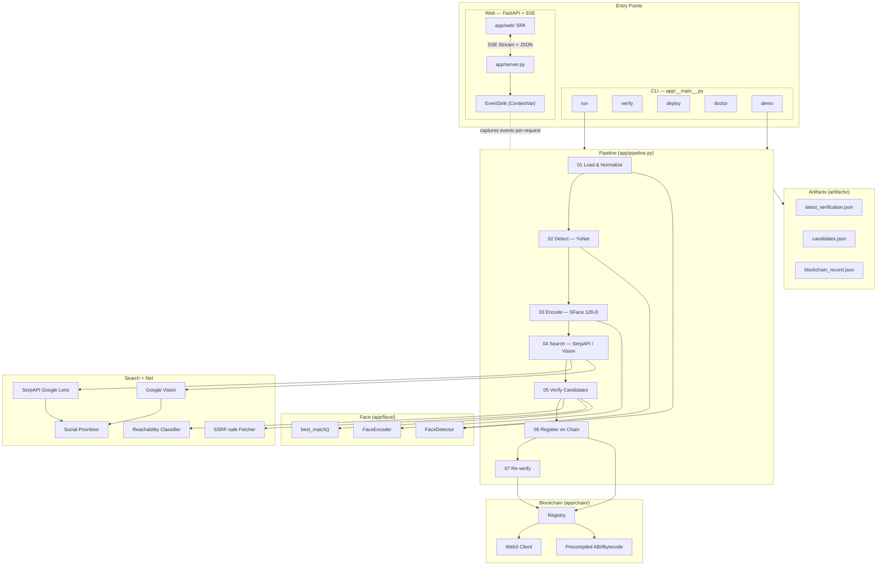

# Face ID + Blockchain Verification

> **An auditable evidence pipeline**: detect a face → search the web for it → verify across multiple sources → deterministically select a canonical match → cryptographically fingerprint the record → anchor it on Ethereum Sepolia — all in one command.


<p align="center"><em>Built for Hacker House Goa 2026 — Shortlisting Task #3</em></p>

---

## ⚡ The 60-Second Evaluator Flow

If you only have two minutes to evaluate this submission, run this exact sequence:

```
[1] ZERO-CONFIG TEST    python -m pytest tests/ -v
         │              ↳ 152 offline tests across 11 modules — zero API keys or network required
         ▼
[2] RUN DEMO            python -m app demo --image samples/input.jpg
         │              ↳ Watch YuNet detection → SFace encoding → live web search → multi-source verification
         ▼
[3] DUAL SURFACES       Terminal UI & Web UI (FastAPI SSE) consume identical structured audit events
         │              ↳ Fail-safe: Terminal rendering crashes are isolated; pipeline never aborts
         ▼
[4] INSPECT PROOF       Open artifacts/latest_verification.json
         │              ↳ Canonical JSON (float-quantized, sorted keys) + SHA-256 fingerprint
         ▼
[5] VERIFY ON-CHAIN     python -m app verify
         │              ↳ Queries Sepolia contract → [PASS] Local hash matches on-chain commitment
         ▼
[6] TAMPER ATTACK       Mutate 1 value in the JSON artifact → python -m app verify
                        ↳ [🚨 TAMPER DETECTED] Local recomputed SHA-256 ≠ on-chain commitment
```

### 🚨 10-Second Tamper Attack Demo

This illustrates how the cryptographic integrity model works in practice:

```bash
# Step 1: Run read-back verification against Ethereum Sepolia
python -m app verify
# Output: [PASS] Local SHA-256 matches on-chain commitment 0x8a3f...

# Step 2: Tamper with a single field in the local JSON artifact
# (e.g. edit artifacts/latest_verification.json: change "similarity": 0.812345 to 0.999999)

# Step 3: Run verification again
python -m app verify
# Output: [TAMPER DETECTED] Local SHA-256 (0x7c9b...) != On-chain commitment (0x8a3f...)
```

---

## 💡 Core Technical Innovations

### 1. Deterministic Multi-Source Provenance (Solving Web Nondeterminism)
Web reverse-image searches are inherently nondeterministic: CDN rate limits, botwalls, dynamic ranking, and network jitter cause different candidates to win on different runs. A naive system that halts on the "first match" will produce different hashes for identical images.

Our Stage 5 pipeline solves this by:
1. **Evaluating up to 10 candidates in parallel** (never short-circuiting on the first match).
2. **Re-verifying candidate faces** using YuNet detection and SFace cosine similarity.
3. **Collecting all validated sources** in a sorted evidence set.
4. **Deterministic 5-tier primary ranking key**:
   $$\text{Similarity Bucket} \longrightarrow \text{Link Usability} \longrightarrow \text{Image Origin} \longrightarrow \text{Search Rank} \longrightarrow \text{Lexicographical URL}$$

> **Result:** Identical input portraits always yield the exact same canonical primary record and identical hash, regardless of network jitter.

### 2. Immutable Cryptographic Anchor (Zero Biometrics On-Chain)
We do **not** store faces, embeddings, or personal information on-chain.
* The 128-D SFace biometric vector exists **in memory only** and is never serialized or logged.
* The pipeline canonicalizes evidence into strict JSON (`sort_keys=True`, `separators=(",", ":")`, floats quantized to 6 decimal places).
* The 32-byte SHA-256 digest (`bytes32 recordHash`) is anchored to Ethereum Sepolia.

> **The Architectural Boundary:** The blockchain does not claim to prove that an internet claim is objectively true. It proves that the canonical verification record has not been altered, backdated, or fabricated since the timestamp of confirmation.

### 3. Synchronized Dual-Surface Architecture (Fail-Safe)
The verification pipeline (`pipeline.run()`) emits typed, structured audit events to a thread-isolated `EventSink`:
```
                               ┌──→ Web UI: Browser SSE Stream (FastAPI server.py)
pipeline.run() ── EventSink ──┤
                               └──→ CLI: Terminal Audit Renderer (terminal.py)
```
* **Shared state:** Both the terminal dashboard and the web frontend consume the exact same event stream.
* **Failure isolation:** The `TerminalAuditRenderer` wraps all display logic in a fail-safe boundary (`try/except`). A terminal rendering error or window resizing crash **cannot take down the verification pipeline**.

---

## Evaluator Quick Start

```bash
# 1. Clone & install
git clone https://github.com/Harshy-cmd/HH_Goa-T3.git
cd HH_Goa-T3
python -m venv .venv
source .venv/bin/activate          # Windows: .venv\Scripts\activate
pip install -r requirements.txt

# 2. Configure (fill in API key + blockchain credentials)
cp .env.example .env

# 3. Pre-flight — confirms API keys, model weights, chain connectivity
python -m app doctor

# ─── Zero-config inspection (no API keys needed) ───────────────────────────
python -m pytest tests/ -v         # 152 offline tests, all pass

# ─── API-dependent (needs SERPAPI_API_KEY) ──────────────────────────────────
python -m app demo --image samples/input.jpg   # evaluator dashboard mode
python -m app run  --image samples/input.jpg   # full pipeline, structured output

# ─── Blockchain-dependent (needs RPC_URL + PRIVATE_KEY + CONTRACT_ADDRESS) ──
python -m app deploy               # deploy VerificationRegistry → paste address in .env
python -m app run  --image samples/input.jpg   # detect → search → verify → anchor
python -m app verify               # re-verify latest artifact vs. blockchain
```

> **Note on `demo` vs `run`:** `run` defaults to structured evaluator-dashboard mode. Pass `--plain` to get linear log output instead.

---

## Evaluator Snapshot

| Attribute | Value |
|---|---|
| **Pipeline stages** | 7 (Load → Detect → Encode → Search → Verify → Register → Re-verify) |
| **Face detector** | OpenCV YuNet (ONNX, `cv2.FaceDetectorYN`) |
| **Face encoder** | OpenCV SFace — 128-dimensional embeddings |
| **Similarity metric** | Cosine — MATCH ≥ 0.363 · POSSIBLE MATCH ≥ 0.300 · NO MATCH below |
| **Search providers** | SerpAPI Google Lens (primary) · Google Cloud Vision WEB_DETECTION (fallback) |
| **Candidate probe depth** | Up to 10 candidates; all validated matches collected |
| **Blockchain network** | Ethereum Sepolia (any EVM via chain ID detection) |
| **Smart contract** | `VerificationRegistry.sol` — Solidity 0.8.28, MIT |
| **Integrity mechanism** | SHA-256 over canonical JSON → `bytes32` → on-chain commitment |
| **Tamper verdict** | PASS · TAMPER DETECTED · FAIL |
| **Test suite** | **152 tests · 11 modules · 100% offline** |
| **Web interface** | FastAPI + Vanilla SPA — drag-drop upload, 7-stage live rail, SSE streaming |
| **CLI interface** | `python -m app` — run · demo · verify · deploy · doctor |
| **Live streaming** | Server-Sent Events (SSE) — real-time stage progress to browser |
| **Deployment** | Render Blueprint (`render.yaml`) — service name `faceid-verify` |
| **Version** | 1.2.0 |

---

## Why This Project Is Different

| Conventional approach | This implementation |
|---|---|
| First matching result accepted | Multi-candidate probe — up to 10 sources evaluated |
| Non-deterministic source selection | Deterministic 5-tier ranking key — same input always produces same primary source |
| Local-only evidence | SHA-256 cryptographic fingerprint + Ethereum Sepolia anchor |
| Hidden pipeline state | Technical Pipeline Inspector modal + evaluator API endpoints |
| Generic log output | Structured SSE audit stream — categorised, parseable events |
| Re-submission wastes gas | Idempotent registry — duplicate hashes cost **0 gas** |
| Face embeddings stored or logged | Embeddings exist **in memory only**, never serialised anywhere |
| Candidate fetch unconstrained | SSRF-safe fetcher — private IPs, loopback, and link-local ranges rejected |
| Unlimited concurrency | Bounded `MAX_CONCURRENT_JOBS` — clean `HTTP 429` on overload |

**The core claim:** this is not a face-recognition demo with blockchain added for show, and not a blockchain demo that mocks computer vision. Both subsystems do real work; the integrity of each is verified against the other.

---

## 7-Stage Pipeline

```
INPUT IMAGE → DETECT → ENCODE → SEARCH → VERIFY → REGISTER → RE-VERIFY
```

### 01 — Load & Normalize

| | |
|---|---|
| **Input** | Any local image file |
| **Implementation** | `app/imaging.py` — OpenCV-first with Pillow fallback; EXIF orientation corrected; AVIF/HEIC/HEIF supported via `pillow-heif`; images > 500 KB re-encoded for SerpAPI's upload limit |
| **Output** | BGR array + `InputImage` (filename, SHA-256 of original bytes, dimensions, search-copy digest) |
| **Why** | Separates the input fingerprint from the search copy so image re-encoding never corrupts the record hash |

### 02 — Detect

| | |
|---|---|
| **Input** | BGR array |
| **Implementation** | `app/face/detector.py` — `cv2.FaceDetectorYN` (YuNet ONNX); minimum confidence `0.850`; results sorted largest-face-first |
| **Output** | `list[DetectedFace]` — bounding box `(x, y, w, h)`, confidence, landmarks |
| **Why** | Millisecond-level detection with no system-level dependencies (no cmake, dlib, or GPU) |

### 03 — Encode

| | |
|---|---|
| **Input** | BGR array + target `DetectedFace` |
| **Implementation** | `app/face/encoder.py` — `cv2.FaceRecognizerSF` (SFace ONNX); face alignment then 128-D embedding; **vector never leaves memory** |
| **Output** | `FaceEncoding` — 128-dimensional vector (in-process only) |
| **Why** | SFace embeddings enable cosine similarity comparison; keeping them memory-only is a deliberate privacy decision |

### 04 — Search

| | |
|---|---|
| **Input** | Re-encoded image bytes |
| **Implementation** | `app/search/serpapi.py` (primary) or `app/search/google_vision.py` (fallback); results normalised to `SearchResult[]`; 20+ social platforms detected by URL; social results promoted to front of probe queue |
| **Output** | `SearchResponse` — ranked list of `SearchResult` (page URL, image URL, title, platform, rank) |
| **Why** | Live, non-cached API call; never pre-seeded or mocked |

### 05 — Verify Candidates

| | |
|---|---|
| **Input** | `SearchResult[]` ordered social-first |
| **Implementation** | `app/net/fetch.py` downloads each candidate image (SSRF-safe, max 12 MB); `app/net/reachability.py` classifies links concurrently (live / login_wall / dead); `app/face/matcher.py` computes cosine similarity; **all** validated matches collected into `validated_sources` |
| **Output** | Primary `CandidateVerification` (deterministically selected) + `validated_sources[]` |
| **Why** | Multi-candidate collection eliminates non-determinism; deterministic ranking (see §Deterministic Provenance) ensures same input → same primary source |

### 06 — Register

| | |
|---|---|
| **Input** | `VerificationRecord.to_record()` dict |
| **Implementation** | `app/hashing.py` → `canonical_json()` → `sha256_hex()` → `to_bytes32()`; `app/chain/registry.py` calls `registerVerification(bytes32, string, string)` — pre-checked for idempotency first |
| **Output** | `ChainReceipt` (tx hash, block number, gas used, idempotent flag) |
| **Why** | Commits the cryptographic fingerprint immutably; duplicate hashes short-circuit with 0-gas idempotent read |

### 07 — Re-verify

| | |
|---|---|
| **Input** | Local `record_hash` |
| **Implementation** | `registry.get_record(hash)` → on-chain `Record`; local hash compared to on-chain hash |
| **Output** | `PASS` / `TAMPER DETECTED` / `FAIL` |
| **Why** | Closes the trust loop — the pipeline itself validates that the committed hash matches the artifact it just wrote |

---

## Proof & Evidence

No live demo URL is currently published (the Render Blueprint is configured but a stable URL is not guaranteed for evaluation). Evaluators can inspect the pipeline through the following channels:

### Run it yourself (recommended)

```bash
# Full pipeline — produces artifacts/latest_verification.json
python -m app run --image samples/input.jpg

# Tamper demonstration
#   1. Edit artifacts/latest_verification.json (e.g. change any similarity value)
#   2. Re-run verify — the recomputed hash won't match the blockchain record
python -m app verify
```

### Evaluator API endpoints (web server running)

```bash
uvicorn app.server:app --host 127.0.0.1 --port 8000
```

| Endpoint | Returns |
|---|---|
| `GET /api/pipeline-info` | Contract address, chain ID, model versions, thresholds, memory bounds |
| `GET /api/latest-artifact` | Raw JSON of the last verification artifact |

### Artifact shape (`artifacts/latest_verification.json`)

```jsonc
{
  "artifact_version": "...",
  "record": {
    "schema_version": "...",
    "created_at": "2026-...",
    "input": {
      "filename": "input.jpg",
      "sha256": "<hex — fingerprint of original file bytes>",
      "width": 640, "height": 480, "bytes_len": 98304,
      "search_copy_sha256": "<hex — may differ after re-encode>"
    },
    "search": { "provider": "serpapi", "result_count": 12, ... },
    "candidate": {
      "similarity": 0.812345,
      "verdict": "MATCH",
      "threshold": 0.363,
      "page_url": "https://...",
      ...
    },
    "validated_sources": [ ... ]
  },
  "record_hash": "<64-char SHA-256 hex digest of canonical JSON above>",
  "blockchain": {
    "network": "Sepolia Testnet",
    "contract_address": "0x...",
    "transaction_hash": "0x...",
    "block_number": 1234567,
    "gas_used": 167000,
    "idempotent": false
  }
}
```

### Deploy and inspect the contract yourself

```bash
python -m app deploy      # prints CONTRACT_ADDRESS — paste into .env
python -m app doctor      # confirms chain connectivity, wallet balance, models
```

---

## Architecture



**Communication model:** CLI calls `pipeline.run()` directly. The web server wraps each job in a `ThreadPoolExecutor`, captures `ui.*` calls via a `ContextVar`-isolated `EventSink`, and pushes real-time events to the browser as SSE. A 15-second heartbeat (`': heartbeat\n\n'`) keeps connections alive during Ethereum transaction confirmation (15–180 s).

---

## Deterministic Provenance

### The Problem

A reverse-image search for a well-known face returns dozens of source pages. A naive pipeline that breaks on the first reachable, verifiable result is non-deterministic: network conditions, CDN rate-limiting, and platform bot-detection cause different pages to win on different runs.

### The Bill Gates Case Study

During evaluation on a test portrait:

- **Run 1** selected **The New York Times** as the verified primary source.
- **Run 2** selected **Instagram** as the verified primary source.

**Root cause:** Google Lens returned 59 candidates (NYT ranked #1 and #2; Instagram ranked #9). The social prioritiser promoted Instagram to the head of the probe queue. On runs where Instagram returned `200 OK`, it matched first. On runs where Instagram returned `401 / 403`, NYT won. Same image, same search results — different canonical record, different hash, different blockchain commitment.

### The Solution: Multi-Candidate Architecture

1. **Probe all candidates** — up to 10 top pages are evaluated in parallel; none short-circuits.
2. **Collect all validated sources** — every candidate that passes facial similarity is recorded in `validated_sources`.
3. **Select deterministically** using a strict 5-tier key:

| Tier | Criterion | Rationale |
|---|---|---|
| 1 | Similarity bucket `round(sim, 2)` — higher first | Group statistically indistinguishable matches |
| 2 | Link usability: `live` (3) > `login_wall` (2) > `unknown` (1) > `dead` (0) | Prefer sources an evaluator can open immediately |
| 3 | Image origin: direct publisher (1) > provider thumbnail (0) | Prefer first-party evidence |
| 4 | Search engine rank — lower number preferred | Trust the search engine's own relevance signal |
| 5 | Page URL — lexicographic tie-breaker | Makes the choice fully deterministic across all environments |

**Result:** identical inputs always produce the identical primary source and identical `record_hash`, regardless of network conditions.

---

## Cryptographic Integrity Model

```
VerificationRecord.to_record()
        │
        ▼
canonical_json()     ←  sort_keys=True · separators=(",",":") · ensure_ascii=False · allow_nan=False
        │                floats quantized to 6 decimal places via round()
        ▼
   SHA-256 hex digest  (record_hash)
        │
        ▼
   to_bytes32()        (64-char hex → 32 bytes)
        │
        ▼
registerVerification(bytes32, source, url)  →  Ethereum Sepolia
        │
        ▼
   getRecord(bytes32)  →  on-chain Record
        │
        ▼
   local_hash == on_chain_hash?
```

### Two Integrity Questions

| Question | Method | Result |
|---|---|---|
| Has the local artifact changed since it was committed? | Recompute hash from artifact's `record` field; compare to stored `record_hash` | PASS / TAMPER DETECTED |
| Does the current artifact still match the blockchain commitment? | Query `getRecord(recomputed_hash)`; check `blockTimestamp ≠ 0` | PASS / FAIL |

### Verdicts

| Verdict | Meaning |
|---|---|
| ✅ **PASS** | Recomputed hash matches stored hash matches on-chain hash — artifact is intact |
| ⚠️ **TAMPER DETECTED** | Stored `record_hash` is on-chain, but recomputing from the current `record` produces a different hash — the artifact was modified after commitment |
| ❌ **FAIL** | Neither hash found on-chain — never registered, or wrong network/contract |

### Contract Errors (Solidity)

```solidity
error EmptyRecordHash();
error RecordAlreadyExists(bytes32 recordHash);   // ← duplicate write reverts here
error RecordNotFound(bytes32 recordHash);
```

Re-registering the same `bytes32` reverts with `RecordAlreadyExists`. The Python side pre-checks with `isRegistered()` so duplicate images are handled before broadcasting a transaction — consuming **0 gas**.

---

## Technical Pipeline Inspector

The web UI includes a **Pipeline Inspector** modal (header `Inspector` button), providing 100% transparency for evaluators:

- **Canonical JSON viewer** — exact JSON payload before hashing, with one-click copy
- **Hash derivation visual** — Input Image → YuNet → SFace → Canonical JSON → SHA-256 → Sepolia
- **Contract & network parameters** — Solidity method signatures, idempotency status, chain ID
- **Biometric geometry** — face bounding box, detection confidence, cosine similarity
- **Memory budget display** — documents how the 512 MB Render container limit is respected

**API endpoints:**

```
GET /api/pipeline-info    →  contract address, chain ID, model versions, thresholds
GET /api/latest-artifact  →  raw verification artifact JSON from disk
```

---

## Security & Privacy

### Security Measures

| Area | Implementation |
|---|---|
| **SSRF protection** | `net/fetch.py` and `net/reachability.py` reject URLs resolving to private, loopback, link-local, or reserved IP ranges |
| **Private key handling** | Never leaves the process; never logged, serialised, or printed; transactions signed locally |
| **Model integrity** | ONNX weights verified against pinned SHA-256 digests after download |
| **Secrets management** | `.env` is gitignored; `.env.example` contains no real values |
| **Candidate image limits** | Max 12 MB download, streaming with early abort, content-type validation |
| **Input validation** | Config thresholds, file existence, image decodability, contract address checksumming — all validated at startup |
| **Error hierarchy** | 15 typed error classes — every failure mode produces a readable message, not a raw traceback |

### Privacy Properties

- Face embeddings exist **in memory only** — never serialised, logged, stored, or transmitted
- The blockchain record contains **no images, no embeddings, no biometric data**
- The pipeline does **not** bypass authentication, CAPTCHAs, or access controls
- The pipeline does **not** access private profiles or paywalled content
- The pipeline does **not** claim to identify real-world individuals

### What Blockchain Proves (and Does Not Prove)

- ✅ The recorded data has not changed since it was committed at a specific block timestamp
- ❌ The underlying face match was correct
- ❌ The search result was meaningful
- ❌ The person in the image is who anyone says they are

---

## Installation & Setup

### Prerequisites

- **Python 3.10+**
- A **SerpAPI key** (free tier: 100 searches/month at [serpapi.com](https://serpapi.com/users/sign_up)) _or_ a **Google Cloud Vision API key**
- A **throwaway Sepolia testnet wallet** with ~0.005 ETH (one verification costs ~167,000 gas)

### 1. Clone and Install

```bash
git clone https://github.com/Harshy-cmd/HH_Goa-T3.git
cd HH_Goa-T3
python -m venv .venv
source .venv/bin/activate      # Windows: .venv\Scripts\activate
pip install -r requirements.txt
```

### 2. Configure Environment

```bash
cp .env.example .env
```

Minimum required configuration:

```ini
SERPAPI_API_KEY=your_key_here
RPC_URL=https://ethereum-sepolia-rpc.publicnode.com
PRIVATE_KEY=0xyour_throwaway_testnet_private_key
CONTRACT_ADDRESS=                    # fill after: python -m app deploy
```

<details>
<summary><strong>Full .env.example</strong></summary>

```bash
# Reverse Image Search
SEARCH_PROVIDER=serpapi
SERPAPI_API_KEY=
GOOGLE_VISION_API_KEY=

# Blockchain
RPC_URL=https://ethereum-sepolia-rpc.publicnode.com
PRIVATE_KEY=
CONTRACT_ADDRESS=

# Face Matching (optional — these are the OpenCV-published defaults)
FACE_MATCH_THRESHOLD=0.363
FACE_REVIEW_THRESHOLD=0.300
FACE_DETECT_CONFIDENCE=0.850
```

</details>

### 3. Get Testnet ETH

- [Google Cloud Sepolia Faucet](https://cloud.google.com/application/web3/faucet/ethereum/sepolia)
- [Alchemy Sepolia Faucet](https://www.alchemy.com/faucets/ethereum-sepolia)

### 4. Deploy the Smart Contract

```bash
python -m app deploy
# → prints CONTRACT_ADDRESS — paste into .env
```

### 5. Download Model Weights (auto on first run, or explicit)

```bash
python -m app download-models   # ~39 MB one-time download
```

### 6. Verify Setup

```bash
python -m app doctor
```

---

## Usage

### Full Pipeline

```bash
python -m app run --image samples/input.jpg
# or select a specific face if multiple are detected:
python -m app run --image samples/input.jpg --face 0
```

### Evaluator Dashboard Mode

```bash
python -m app demo --image samples/input.jpg
```

Produces a box-drawing terminal scorecard with stage tables, Unicode metrics, and audit logs.

### Tamper Demonstration

```bash
python -m app run --image samples/input.jpg   # 1. run pipeline
# 2. open artifacts/latest_verification.json and change any value
python -m app verify                           # 3. → TAMPER DETECTED
```

### Re-verify a Specific Artifact

```bash
python -m app verify --record path/to/verification.json
```

---

## Web Application

```bash
uvicorn app.server:app --reload --host 127.0.0.1 --port 8000
# Open http://127.0.0.1:8000
```

**Features:**

- **Drag-and-drop upload** — JPEG, PNG, WebP, AVIF, HEIC/HEIF; validated, capped at 15 MB
- **7-stage live rail** — real-time SSE progress through all pipeline stages
- **Embedded terminal console** — streams coloured `ok` / `info` / `warn` / `kv` events
- **Face bounding box overlay** — detected face coordinates drawn on the input image canvas
- **Animated similarity gauge** — cosine similarity dial with MATCH / POSSIBLE MATCH / NO MATCH
- **Candidate evidence cards** — publisher thumbnails, platform tags, reachability status
- **On-chain proof panel** — Etherscan/Blockscout links, tx hash, block number, gas used
- **One-click tamper verification** — verify stored artifact, or inject a 1-bit discrepancy to demonstrate detection

**Concurrency model:** each request binds an `EventSink` via Python `contextvars` — zero global mutation. Bounded at `MAX_CONCURRENT_JOBS=1` on Render's 512 MB free tier; additional requests receive clean `HTTP 429`.

---

## CLI Commands

| Command | Purpose |
|---|---|
| `python -m app run --image <path> [--face <n>] [--plain]` | Full pipeline (evaluator dashboard unless `--plain`) |
| `python -m app demo --image <path>` | Evaluator terminal dashboard with scorecard |
| `python -m app verify [--record <path>]` | Re-verify artifact against blockchain |
| `python -m app deploy` | Deploy a fresh `VerificationRegistry` contract |
| `python -m app doctor` | Pre-flight: API keys, model weights, chain, wallet |
| `python -m app download-models` | Pre-download YuNet + SFace ONNX weights (~39 MB) |
| `python -m app precompile` | Regenerate `contracts/build/VerificationRegistry.json` |
| `python -m app --version` | Print version (`1.2.0`) |
| `uvicorn app.server:app --port 8000` | Start FastAPI web application |

---

## Testing

```bash
python -m pytest tests/ -v
```

**152 tests · 11 modules · all offline** — no API keys, no network, no live blockchain required.

| Module | Tests | What It Covers |
|---|---:|---|
| `test_hashing.py` | 19 | Canonical JSON byte-pinning, SHA-256, float quantisation, `to_bytes32`, determinism, NaN rejection |
| `test_social.py` | 23 | Platform detection for 20+ social platforms, URL redirect extraction, Google query unwrap |
| `test_reachability.py` | 22 | Concurrent link classification (live/login-wall/dead), HEAD→GET fallback, timeouts, SSRF private-IP protection |
| `test_terminal_renderer.py` | 13 | `TerminalAuditRenderer` — all event types (hello/step/log/kv/milestone/verdict/result/error), ANSI/TTY/NO_COLOR handling, renderer failure isolation, exact SSE payload preservation, concurrent thread safety |
| `test_server.py` | 13 | FastAPI upload validation, size caps, SSE streaming with mocked pipeline, single-use jobs, 429 concurrency guard, verify/tamper API |
| `test_imaging_decode.py` | 14 | Universal decoders (JPEG/PNG/WebP/BMP/GIF/AVIF/HEIC), EXIF orientation, downscale, empty-bytes rejection |
| `test_config.py` | 12 | Threshold validation, per-command `require_*` checks, private key normalisation, invalid provider |
| `test_serialization.py` | 12 | `VerificationRecord.to_record()`, artifact round-trip, schema version, no-embedding-in-record, hash stability |
| `test_matching.py` | 9 | Three-way verdict at and around thresholds, OpenCV constant pinning |
| `test_multi_source_and_idempotency.py` | 7 | Deterministic candidate ranking, secondary source tracking, on-chain pre-check, duplicate idempotency |
| `test_demo_formatting.py` | 8 | ANSI stripping, Unicode box-drawing alignment, metric padding, scorecard layout |
| **Total** | **152** | |

### What Is Deliberately Not Tested

- **End-to-end live blockchain integration** — requires funded wallet and live RPC; `doctor` serves as the manual pre-flight.
- **Face detection/encoding** — depends on 39 MB ONNX weights; exercised through the pipeline itself.

---

## Project Structure

```
HH-Goa-T3/
├── app/
│   ├── __main__.py            # CLI entry point (run|demo|verify|deploy|doctor|…)
│   ├── pipeline.py            # 7-stage orchestrator — read this first
│   ├── models.py              # All dataclasses: FaceBox → VerificationRecord → Artifact
│   ├── hashing.py             # canonical_json() + record_hash() — stability-critical
│   ├── config.py              # .env loading, per-command validation, thresholds
│   ├── server.py              # FastAPI backend — SSE streaming, bounded concurrency
│   ├── terminal.py            # TerminalAuditRenderer — structured audit output
│   ├── ui.py                  # Terminal + ContextVar EventSink delegation
│   ├── demo.py                # Evaluator dashboard — box-drawing scorecard
│   ├── imaging.py             # Universal decoder (OpenCV + Pillow/AVIF/HEIC)
│   ├── artifacts.py           # Read/write JSON artifacts
│   ├── errors.py              # 15-class typed error hierarchy
│   ├── web/                   # Zero-build SPA (index.html, styles.css, app.js, fibers.js)
│   ├── face/                  # detector.py · encoder.py · matcher.py · models_store.py
│   ├── search/                # serpapi.py · google_vision.py · social.py · registry.py
│   ├── chain/                 # client.py · registry.py · compile.py
│   └── net/                   # fetch.py (SSRF-safe) · reachability.py
├── contracts/
│   ├── VerificationRegistry.sol          # Solidity 0.8.28 — MIT
│   └── build/VerificationRegistry.json  # Precompiled ABI + bytecode (runtime, no compiler needed)
├── tests/                     # 152 offline tests (11 modules)
├── artifacts/                 # Pipeline output — gitignored, regenerated each run
├── models/                    # ONNX weights — gitignored, ~39 MB, fetched on first run
├── samples/                   # Input images — gitignored (biometric data)
├── render.yaml                # Render Blueprint (service: faceid-verify)
├── render-build.sh            # Build script: pip install + model download
├── requirements.txt           # Pinned production dependencies
├── requirements-dev.txt       # Dev + test dependencies
├── .env.example               # Configuration template
└── LICENSE                    # MIT
```

<details>
<summary><strong>Data flow summary</strong></summary>

```
Image file on disk
  → bytes SHA-256 (input fingerprint, never changes)
  → OpenCV decode → BGR array
  → YuNet detection → DetectedFace[]
  → SFace alignment + encoding → FaceEncoding (128-D vector, in-memory only)
  → Search provider API → SearchResult[] (normalised, social-annotated)
  → For each candidate: SSRF-safe fetch → detect → encode → cosine compare
  → VerificationRecord.to_record() → dict
  → canonical_json(dict) → bytes
  → SHA-256(bytes) → hex digest → to_bytes32() → bytes32
  → registerVerification(bytes32, source, url) → Ethereum Sepolia
  → getRecord(bytes32) → on-chain Record → hash comparison
  → PASS / TAMPER DETECTED / FAIL
  → Artifacts written to disk (JSON)
```

</details>

---

## Smart Contract

**`contracts/VerificationRegistry.sol`** — Solidity 0.8.28, ~84 lines, MIT

```solidity
struct Record {
    bytes32 recordHash;     // SHA-256 of the canonical JSON record
    uint64  blockTimestamp;  // block.timestamp at commitment
    address submitter;       // msg.sender
    string  source;          // platform label (e.g. "Reddit")
    string  candidateUrl;    // public URL of the discovered post
}
```

| Function | Type | Description |
|---|---|---|
| `registerVerification(bytes32, string, string)` | Write | Commit a record hash. Reverts `EmptyRecordHash()` on zero hash; reverts `RecordAlreadyExists(bytes32)` on duplicate. |
| `getRecord(bytes32)` | Read | Returns the full `Record`. Reverts `RecordNotFound(bytes32)` if not found. |
| `isRegistered(bytes32)` | Read | Returns `bool`. Never reverts. Used for idempotency pre-check. |
| `recordCount()` | Read | Total registered records. |

**Security properties:**
- Records are **immutable once written** — `RecordAlreadyExists` prevents timestamp/submitter overwriting
- Stores **only** hash, platform label, and URL — no images, no embeddings, no personal data
- No access control on writes — intentional for a public registry

---

## Environment Variables

| Variable | Required | Default | Description |
|---|:---:|---|---|
| `SEARCH_PROVIDER` | No | `serpapi` | `serpapi` or `google_vision` |
| `SERPAPI_API_KEY` | Yes* | — | SerpAPI key ([free: 100/month](https://serpapi.com/users/sign_up)) |
| `GOOGLE_VISION_API_KEY` | Yes* | — | Cloud Vision key ([free: 1000/month](https://console.cloud.google.com/apis/credentials)) |
| `RPC_URL` | Yes | — | Ethereum JSON-RPC endpoint |
| `PRIVATE_KEY` | Yes | — | Hex private key of a throwaway testnet wallet |
| `CONTRACT_ADDRESS` | Yes | — | Deployed `VerificationRegistry` address |
| `FACE_MATCH_THRESHOLD` | No | `0.363` | Cosine similarity threshold for MATCH |
| `FACE_REVIEW_THRESHOLD` | No | `0.300` | Lower bound for POSSIBLE MATCH band |
| `FACE_DETECT_CONFIDENCE` | No | `0.850` | Minimum YuNet detection confidence |
| `MAX_CONCURRENT_JOBS` | No | `1` | Max parallel pipeline jobs (Render free-tier default) |

> \* Only the key for the selected `SEARCH_PROVIDER` is required.

---

## Deployment (Render)

The repository includes a [Render Blueprint](https://render.com/docs/blueprint-spec) (`render.yaml`, service name: `faceid-verify`).

1. Push to GitHub/GitLab
2. Render Dashboard → **New +** → **Blueprint** → connect repository
3. Fill secret env vars: `SERPAPI_API_KEY`, `PRIVATE_KEY`, `CONTRACT_ADDRESS`
4. Click **Apply** — Render runs `render-build.sh` (pip install + model download) and starts Uvicorn

**Free-tier optimizations baked in:**
- `opencv-python-headless` — eliminates `libGL` system dependency
- Precompiled contract ABI/bytecode committed under `contracts/build/` — no solc at runtime
- Candidate images downscaled to max 1600px — prevents 512 MB OOM
- `MAX_CONCURRENT_JOBS=1` — clean HTTP 429 on overload
- SSE heartbeat every 15 s — keeps connections alive through Ethereum confirmation delays

---

## Known Limitations

> Honest documentation makes the project more credible, not less.

- **Face similarity ≠ identity.** Cosine similarity above a threshold does not establish who a person is.
- **Search depends on provider indexing.** If an image has never been indexed by Google, the search returns no results — a property of the search engine, not a bug.
- **Social CDNs block hotlinking.** The pipeline handles this transparently: reachability is classified, thumbnail fallback is attempted, failure is reported.
- **SerpAPI upload limit.** Large images are re-encoded to ≤ 500 KB. The original file's SHA-256 is always preserved as the input fingerprint.
- **Public testnet.** Sepolia may reorganise, be deprecated, or experience downtime.
- **Single-use web jobs.** Each staged UUID can be streamed once. Refreshing does not re-trigger a blockchain write.
- **No automated integration tests for live blockchain.** These require a funded wallet and live RPC; `doctor` is the manual pre-flight.

---

## Future Improvements

Not currently implemented. Realistic extensions of the existing architecture:

- **Batch processing** — multiple images with a summary report
- **Multi-chain support** — Base, Polygon, or other EVMs (chain ID detection already works)
- **Automated integration tests** — local Anvil node + mocked search responses
- **IPFS artifact pinning** — store the full artifact alongside the on-chain hash
- **Embedding storage option** — opt-in encrypted local storage for re-verification without re-encoding
- **Webhook notifications** — Slack/Discord/webhook on pipeline completion

---

## Contributing

1. Fork the repository
2. `git checkout -b feature/your-feature`
3. `pip install -r requirements.txt -r requirements-dev.txt`
4. Make changes; run `python -m pytest tests/ -v`
5. Open a pull request

**Code conventions:**
- All errors are subclasses of `PipelineError` (`app/errors.py`)
- Data flows as frozen dataclasses (`app/models.py`)
- No business logic in `__main__.py` — only argument parsing and dispatch
- Face embeddings must never appear in any serialised output

---

## License

MIT — see [LICENSE](./LICENSE).

*(The smart contract source carries the same `// SPDX-License-Identifier: MIT` header.)*

---

<details>
<summary><strong>🤖 AI / LLM Context</strong></summary>

> This section provides a compact technical map of the repository for AI coding assistants.

### Project Intent

A **CLI pipeline + interactive Web Application** chaining computer vision (face detection + recognition), live reverse-image-search APIs, deterministic hashing, and Ethereum smart contract interaction into a single auditable verification flow. Built as Hacker House Goa 2026, Task #3.

### Architecture at a Glance

```
CLI (__main__.py) / Web SPA (FastAPI server.py)
  → pipeline.py orchestrator
  → {face/, search/, chain/, net/} subsystems
  → artifacts/ output
```

- **Dual interfaces**: CLI and FastAPI async web server with SSE streaming to `app/web/` SPA
- **No database**: records are cryptographically pinned to the blockchain; local outputs in `artifacts/`
- **No global state**: `Config` loaded once and passed to functions; web output captured via `ui.use_sink(ContextVar)`
- **Data flows as frozen dataclasses** defined in `models.py`

### Source of Truth

| Concern | Location |
|---|---|
| CLI argument parsing | `app/__main__.py` |
| Web backend + SSE streaming | `app/server.py` |
| Web frontend SPA | `app/web/` (`index.html`, `styles.css`, `app.js`) |
| Pipeline orchestration (7 stages) | `app/pipeline.py` |
| All dataclasses (15+) | `app/models.py` |
| Configuration + validation | `app/config.py` |
| Error types (15 classes) | `app/errors.py` |
| Canonical hashing (SHA-256) | `app/hashing.py` |
| Universal image decoding | `app/imaging.py` |
| Terminal audit renderer | `app/terminal.py` — `TerminalAuditRenderer` |
| Face detection | `app/face/detector.py` — `FaceDetector` |
| Face encoding | `app/face/encoder.py` — `FaceEncoder` |
| Face comparison | `app/face/matcher.py` — `classify()`, `best_match()` |
| ONNX model download + verification | `app/face/models_store.py` |
| Search provider interface | `app/search/base.py` — `ReverseImageSearchProvider` ABC |
| SerpAPI implementation | `app/search/serpapi.py` |
| Google Vision implementation | `app/search/google_vision.py` |
| Social platform detection | `app/search/social.py` |
| Candidate image download | `app/net/fetch.py` — SSRF-safe streaming fetch |
| Candidate link reachability | `app/net/reachability.py` — concurrent liveness check |
| Web3 connection + network ID | `app/chain/client.py` |
| Solidity compilation + artifact | `app/chain/compile.py` + `contracts/build/` |
| Contract deploy/register/read | `app/chain/registry.py` — `Registry` class |
| Smart contract source | `contracts/VerificationRegistry.sol` |
| Artifact I/O | `app/artifacts.py` |
| Terminal + web event sinks | `app/ui.py` |

### Business Rules

- **Embeddings never leave memory.** `FaceEncoding.__repr__` deliberately hides the vector. No serialisation path exists.
- **Social results are tried first** in candidate verification (`social.prioritise()`).
- **Both publisher image URL and provider thumbnail URL are tried** per candidate, in that order.
- **MATCH requires similarity ≥ `match_threshold` (0.363)**. Between `review_threshold` and `match_threshold` → POSSIBLE MATCH. Below → NO MATCH.
- **Float quantisation `round(x, 6)`** applied before floats enter the hashed record.
- **Duplicate record hashes rejected** by the smart contract (`RecordAlreadyExists` revert). Pre-checked with `isRegistered()` before broadcasting.
- **Verify compares two hashes**: (1) stored vs recomputed (local integrity), (2) recomputed vs on-chain (blockchain integrity).

### Extension Points

| To Add | Where to Change |
|---|---|
| New CLI command | Add subparser in `__main__.py`; add function in `pipeline.py` |
| New search provider | Subclass `ReverseImageSearchProvider` in `search/`; register in `search/registry.py` |
| New social platform | Add domain → label mapping in `search/social.py._PLATFORMS` |
| New record field | Update `VerificationRecord.to_record()` in `models.py` — **bump `SCHEMA_VERSION`** |
| New error type | Subclass `PipelineError` in `errors.py` with a unique `kind` string |
| Local EVM testing | Run `tools/anvil.exe` (Foundry Anvil), set `RPC_URL=http://127.0.0.1:8545` |

### Important Caveats

1. **`hashing.py` is stability-critical.** Never change `canonical_json()` serialisation rules or `quantize()` precision — doing so silently breaks every existing hash.
2. **`VerificationRecord.to_record()` is the canonical record shape.** Adding/removing fields changes the hash. Bump `SCHEMA_VERSION` if the shape must change.
3. **`models/` is gitignored.** ONNX weights (~39 MB) downloaded on first run by `models_store.py`.
4. **`artifacts/` is gitignored.** Regenerated on each run.
5. **`samples/` is gitignored** — face images are biometric data.
6. **`.env` contains real secrets.** Never read or log its contents. Use `.env.example` for documentation.
7. **`ui.py` is output-only.** Prints to stdout with optional ANSI colour. No state, no input handling.
8. **Provider responses are never cached or mocked** in production. Every `search()` call hits a live API.
9. **The smart contract uses custom errors** (`EmptyRecordHash`, `RecordAlreadyExists`, `RecordNotFound`), not `require()` strings. Python catches `ContractCustomError` and `ContractLogicError`.
10. **`tools/anvil.exe`** is a local Foundry Anvil binary for offline EVM testing. Gitignored, not required for normal operation.

</details>

---

> **2-minute action item for the repository owner:** add a one-line description and topics (`computer-vision`, `blockchain`, `face-recognition`, `ethereum`, `fastapi`) in GitHub → Settings → General. The repo currently has no description or topics set.

<p align="center"><em>Built for Hacker House Goa 2026 — Task #3</em></p>
